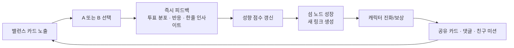
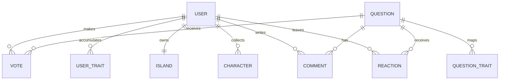

# 밸런스 아일랜드 앱 구축 딥리서치 보고서

## 핵심 요약

이 아이디어의 가장 큰 기회는 **숏폼 소비 습관**, **자기서사형 성향 결과물**, **수집형 코스메틱 경제**를 한 제품 안에서 자연스럽게 묶는 데 있습니다. 현재 공개 사례를 보면, TikTok과 Instagram Reels는 세로형 무한 피드와 추천 기반 소비를 지배하고 있고, 16Personalities·푸망·테스트잇은 “나를 한 문장으로 설명해 주는 결과물”의 공유 욕구를 증명했으며, ZEPETO는 아바타·디지털 패션·브랜드 콜라보 수집욕을 보여줍니다. 반면 **A/B 밸런스게임 피드 + 개인 섬 성장 + 링크드 노드 인사이트 + 한정 캐릭터 수집**을 하나로 묶은 대표 성공품은 뚜렷하지 않아, 포지셔닝상 빈 공간이 분명합니다. citeturn17news2turn16news1turn20view0turn21view0turn41view0turn18news0turn29view0

사업적으로는 **“정확한 성격 검사”보다 “매일 3분 놀다 보면 점점 선명해지는 나의 취향 지도”**로 가는 편이 유리합니다. 검사형 앱은 진입 때 에너지를 많이 요구하지만, A/B 피드는 숏폼 문법 덕분에 진입 장벽이 낮고, 성향 리포트는 결과 공유를, 섬/캐릭터는 복귀 동기를 만듭니다. 핵심은 질문 수를 늘리는 것이 아니라, **첫 7~15개의 선택만으로도 ‘오, 이 앱 나 좀 안다’**는 감각을 주는 것입니다. 이때 리포트는 의료적 진단이나 병리적 해석이 아니라, 선택 패턴·관심 축·상황별 우선순위를 설명하는 **비의학적 자기이해 언어**로 제한해야 합니다. citeturn20view0turn21view0turn29view0turn34view1turn35view0

법·정책 측면에서 가장 중요한 포인트는 세 가지입니다. 첫째, **유상 랜덤 아이템**은 Apple과 Google 모두 구매 직전 확률 공개를 요구합니다. 둘째, 한국에서는 개인정보 규제 집행 강도가 높고, PIPC가 법·가이드·분쟁조정·침해신고 체계를 공식 운영하고 있어 성향 데이터의 수집·보관·활용 문구를 매우 신중하게 설계해야 합니다. 셋째, **MBTI® 문항·리포트·스코어링·브랜드 명칭을 그대로 차용하는 것은 피해야** 하며, 공식 측도 자사 출판물과 평가도구의 복제·변형·소프트웨어 편입에 사전 서면 허가를 요구합니다. citeturn5view1turn5view3turn34view1turn35view0turn36view0turn33news0turn31view0turn31view1turn31view2

실행 우선순위는 “기능 추가”보다 “기반 안정화”가 먼저입니다. 사용자가 업로드한 현재 정적 분석 문서에 따르면, 이 MVP는 이미 Expo Router·Zustand·Supabase 구조를 갖추고 있지만, 인코딩 손상, destructive schema reset, RLS 미정, profile auto-create 부재 같은 기반 리스크가 확인되어 있습니다. 따라서 실제 출시 로드맵은 **피드/투표/인사이트의 감정선 설계**와 **데이터·정책·보안 하드닝**을 동시에 가야 합니다. fileciteturn0file0

## 경쟁 지형과 포지셔닝

아래 표는 “직접 경쟁자”보다, 이 앱의 핵심 조합을 이루는 **인접 성공 패턴**을 비교한 표입니다. MAU가 비공개인 경우에는 회사 공시, 언론 보도, 또는 Similarweb 추정 방문량을 대체 지표로 사용했습니다. citeturn20view0turn21view0turn41view0turn17news2turn16news1turn18news0turn26news1

| 사례 | 핵심 기능 | 수익모델 | 공개 규모 신호 | 바이럴/유지 장치 | 이 앱에 주는 시사점 | 근거 |
|---|---|---|---|---|---|---|
| TikTok | 세로형 무한 피드, 강한 추천 엔진 | 광고, 커머스, 크리에이터 생태계 | 글로벌 월 사용자 10억+; 유럽 월 사용자 2억+ | 추천 피드가 팔로우보다 먼저 작동 | **초기에는 친구 그래프보다 관심 그래프**가 중요 | citeturn17news2 |
| Instagram Reels | Reels + DM + 기존 소셜 그래프 | 광고, 커머스 | Instagram 30억 MAU | 공개 공유보다 **DM 재공유**가 강함 | 결과 카드는 공개 피드보다 **친구에게 보내기**가 더 중요 | citeturn16news1turn16news2 |
| 16Personalities | 무료 성향 테스트, 타입 설명, 관계/직업 콘텐츠 | 공개 세부 수익모델 불명 | 2026년 4월 Similarweb 추정 1,590만 방문 | 결과를 “짧은 정체성 라벨”로 소비 | 결과 설명은 길어도 되지만, **요약 라벨은 한 줄이어야** 함 | citeturn20view0turn20view2 |
| 푸망 | 최신 심테·연애·감정·퍼스널컬러 등 결과형 테스트 | 공개 세부 수익모델 불명 | 2026년 3월 Similarweb 추정 150만 방문 | 한국어권 밈/관계형 테스트의 빠른 순환 | **한국 로컬 밈과 시즌성 질문 덱**이 매우 중요 | citeturn21view0turn21view1 |
| 테스트잇 | 가벼운 바이럴 테스트, 닮은꼴/정체성 놀이 | 공개 세부 수익모델 불명 | 2026년 3월 Similarweb 추정 14.73만 방문; 한국 비중 96.82% | 짧고 가벼운 결과 공유 | 너무 깊은 질문보다 **즉시 반응하는 질문 카드 묶음**이 유리 | citeturn41view0 |
| ZEPETO | 아바타, 아이템, 디지털 패션, 브랜드 협업 | 디지털 아이템, 브랜드 협업 | 누적 사용자 4억+로 소개 | 아바타 꾸미기와 한정판 디지털 패션 | 캐릭터는 **스펙**보다 **소장 미학**으로 팔아야 함 | citeturn18news0 |
| Duolingo | 짧은 세션, streak, mascot 중심 루프 | 구독 중심, 일부 광고/업셀 | 2026년 Q1 기준 5,650만 DAU, 1억 3,780만 MAU | streak와 상징 캐릭터가 습관 형성 | 매일 복귀는 콘텐츠 양보다 **루틴 구조**가 결정 | citeturn26news0turn26news1 |
| Obsidian Graph View | 링크드 노드 관계 시각화 | 참고 UX 사례 | 공개 MAU 없음 | 로컬/글로벌 그래프, 노드·링크 시각화 | 인사이트는 리스트보다 **그래프**가 기억에 남음 | citeturn29view0 |

이 비교에서 보이는 결론은 단순합니다. **당신의 앱은 “검사 앱”이 아니라 “선택 놀이로 자라는 자기세계 앱”**이어야 합니다. 즉, TikTok의 진입성, 푸망/16Personalities의 결과 공유력, ZEPETO의 수집 욕망, Obsidian의 연결 가시성을 한데 묶는 쪽이 가장 설득력 있습니다. 이 포지션이면 사용자에게 “심리검사”보다 덜 부담스럽고, 투자자나 파트너에게는 “숏폼+정체성+컬렉션”이라는 명확한 카테고리 언어를 줄 수 있습니다. citeturn17news2turn16news1turn20view0turn21view0turn18news0turn29view0

## 코어 경험 설계

핵심 루프는 **선택 → 즉시 반응 → 의미 부여 → 시각적 성장 → 공유/복귀**입니다. 사용자는 밸런스 카드에서 A/B를 고르고, 바로 전체 투표 분포·짧은 코멘트·나의 현재 경향 변화를 확인한 뒤, 그 결과가 섬의 노드와 캐릭터 성장으로 번역되어야 합니다. 여기서 중요한 것은 “맞다/틀리다”가 아니라 “지금 내 선택이 어떤 축을 더 진하게 만들고 있는가”를 보여주는 것입니다. Obsidian의 그래프 뷰는 노드와 링크, 로컬 그래프, 노드 크기, 링크 두께, 그룹, 애니메이션 같은 시각 요소로 관계를 직관화하고 있고, Mermaid는 이런 관계를 flowchart와 ER 형태로 설계 문서화하기 좋습니다. citeturn29view0turn29view1turn29view2



이 루프를 제품적으로 풀면, **첫 세션**은 7장의 스타터 카드로 구성하는 것이 좋습니다. 3장째에는 “당신은 완전 즉흥형이 아니라, 익숙한 영역에선 안정 / 낯선 영역에선 호기심이 올라가는 타입 같아요” 같은 **가벼운 중간 피드백**을 주고, 7장째에는 첫 노드 3개를 열어 “음식”, “관계”, “리듬”처럼 큰 축을 보여줍니다. 10장째에는 무료 스타터 캐릭터 1회 뽑기를 열어, 사용자가 **인사이트만이 아니라 수집의 보상**도 즉시 경험하도록 만드는 편이 좋습니다. 이 구조는 숏폼 피드의 저마찰 진입과 정체성 앱의 결과 기대를 묶는 방식입니다. citeturn17news2turn20view0turn21view0turn18news0

리텐션은 “질문이 많은 앱”이 아니라 “복귀 이유가 매일 있는 앱”이 되어야 나옵니다. 가장 안정적인 데일리 루틴은 **매일 10장의 추천 카드**, **출석 보상**, **당일 한정 섬 이벤트**, **저녁 시간대 복귀 푸시**, **주간 합산 리포트**입니다. Duolingo처럼 복귀의 이유를 콘텐츠 깊이가 아니라 루틴 구조로 설계하는 방식이 유효하고, 한국 모바일 게임 연구도 time-gated progression, social dynamics, competitive pressure가 반복적으로 쓰인다고 지적합니다. 다만 이 앱은 과몰입형 게임이 아니라 자기이해형 엔터테인먼트이므로, 압박보다는 “오늘의 섬 날씨를 확인하러 온다”는 감각이 맞습니다. citeturn26news0turn26news1turn47academia0

A/B 테스트 우선순위는 다음 순서가 좋습니다. 가장 먼저 검증할 것은 **첫 인사이트가 뜨는 시점**입니다. 7표 후 공개와 15표 후 공개를 비교해 D1, 첫 세션 길이, 공유율을 봐야 합니다. 그다음은 **무료 뽑기 시점**입니다. 첫 세션 즉시 지급과 3일 연속 출석 후 지급을 비교해 D7과 결제 전환을 봅니다. 세 번째는 **친구 미션 문구**입니다. “친구와 비교하기”보다 “서로 다른 선택을 발견하기”가 댓글 독성을 줄이는지 봐야 합니다. 네 번째는 **푸시 타이밍**으로, 점심·퇴근·취침 전 중 어디가 재방문률이 높은지 실험합니다. 다섯 번째는 **결과 카드 카피 스타일**로, 재치형 문구와 통찰형 문구가 저장·공유·스크린샷 비율에 어떤 차이를 만드는지 확인하면 됩니다. citeturn17news2turn16news2turn26news0turn47academia0

## 캐릭터 가챠와 경제 설계

가챠는 이 앱에서 **매출 장치**이기도 하지만, 더 중요하게는 **복귀 감정의 엔진**입니다. 다만 이 제품에서 뽑기는 “강해지기 위한 장치”가 아니라 “내 섬의 분위기와 서사를 채우는 장치”여야 합니다. 가장 안전한 구조는 **코스메틱 중심 수집형 가챠**입니다. 캐릭터는 능력치 우위를 주지 않고, 섬 스킨, 노드 이펙트, 계절성 애니메이션, 말풍선 보이스, 공유 카드 프레임처럼 **표현 가치**를 강화하는 역할을 맡는 편이 좋습니다. 그래야 규제·윤리·밸런스 리스크를 낮추면서도, 한정판 욕구는 충분히 자극할 수 있습니다. citeturn18news0turn47academia0

권장 희귀도 구조는 **Common / Rare / Epic / Legendary**의 4단계면 충분합니다. MVP에서는 확률을 과도하게 쪼개기보다, 예를 들어 Common 65~75%, Rare 20~25%, Epic 4~8%, Legendary 0.8~1.5% 정도의 “읽기 쉬운 구조”가 좋습니다. 여기에 **20회 내 Epic 보장, 80회 내 Legendary 보장**, 중복 획득 시 “산호 가루”로 자동 변환, 시즌 종료 후 6~12개월 내 재편입 규칙을 붙이면 FOMO는 만들되 분노는 줄일 수 있습니다. 핵심은 **한정판은 사라지되 영원히 소실되지는 않는다**는 신뢰를 주는 것입니다. 과한 희소성은 단기 매출은 만들지만 장기 신뢰를 깎습니다.

소유권 모델은 MVP 단계에서는 **계정 귀속(account-bound)**이 가장 적합합니다. NFT는 지금 단계에선 피하는 편이 낫습니다. Apple은 NFT 관련 민팅·리스팅·양도 서비스를 인앱결제로 허용하지만, NFT 소유권이 앱 기능을 언락해서는 안 된다고 명시하고 있습니다. 즉, 뽑기형 캐릭터 소유가 핵심 경험에 연결되는 당신의 제품과는 방향이 잘 맞지 않습니다. NFT를 붙이면 법적 해석, 앱 심사, 소비자 기대치, 가격·재판매·세무 이슈가 한꺼번에 늘어납니다. **MVP에서는 계정 귀속 + 선택적 재편입 + 투명한 확률 공개**가 가장 현실적입니다. citeturn5view1

확률형 아이템은 플랫폼 정책상 **반드시 구매 직전 확률 공개**를 걸어야 합니다. Apple은 “loot boxes or other mechanisms that provide randomized virtual items for purchase”의 각 유형별 확률 공개를 요구하고, Google Play도 랜덤 가상 아이템의 획득 확률을 구매 전에, 그리고 가까운 위치에서 명확히 고지하라고 요구합니다. 또 IARC는 개발자 설문 과정에서 **게임 내 구매, 랜덤 구매, 타인과의 상호작용, 위치 공유, 인터넷 접근** 같은 요소를 인터랙티브 엘리먼트로 분류해 지역별 등급과 함께 반영합니다. 따라서 이 앱이 최종적으로 “게임”으로 해석되든 “소셜+게이미피케이션 앱”으로 운영되든, 실무적으로는 **게임형 랜덤상품 수준의 투명성**을 처음부터 준비하는 편이 안전합니다. citeturn5view1turn5view3turn40view0turn40view1

가챠는 데일리 루틴과도 붙여야 합니다. 가장 안정적인 구조는 **매일 1회 무료 뽑기**, **주간 챌린지 완료 시 티켓 지급**, **친구 초대나 공유가 아니라 의미 있는 행동**—예컨대 “이번 주 서로 반대 선택 3번 발견하기”—로 티켓을 주는 것입니다. 이렇게 하면 수집욕을 자극하면서도 추천인 스팸이나 강한 압박 루프를 줄일 수 있습니다. 동시에 상점에는 “10회권 할인”, “시즌 패스 보너스 티켓”, “특정 카테고리 픽업 배너”만 두고, 전투력 패키지 같은 공격적 설계는 배제하는 것이 맞습니다. citeturn47academia0

## 시각화와 인터페이스

이 앱의 시각철학은 **“내 선택이 데이터가 아니라 풍경이 된다”**여야 합니다. 그러려면 섬은 단순 대시보드가 아니라, 성향 노드가 자라나는 장소가 되어야 합니다. 추천 구조는 3층입니다. 해변은 최근 7일의 선택을 보여주는 **단기 노드**, 숲은 반복적으로 강화된 관심 축을 보여주는 **안정 노드**, 산/유적은 서로 충돌하는 선택을 담는 **긴장 노드**입니다. 예를 들어 “안정”과 “호기심”이 동시에 높은 사용자는, 한쪽을 지우는 대신 둘 사이의 링크를 굵게 만들어 “상황에 따라 모험을 선택하는 신중파”처럼 표현하는 편이 훨씬 인간적으로 보입니다.

노드 연결 알고리즘은 복잡할 필요가 없습니다. MVP에서는 질문마다 `category_weight`, `trait_vector`, `tone_tag`만 붙이고, 사용자의 선택이 들어올 때마다 아래처럼 업데이트하면 충분합니다.

```text
trait_score(u, t)
= Σ (answer_direction × question_weight × confidence × recency_decay)

edge_weight(i, j)
= 0.6 × co-selection strength
+ 0.4 × semantic similarity
```

여기서 `confidence`는 단순히 A/B 선택뿐 아니라 “확신/고민” 리액션으로 보정할 수 있고, `recency_decay`는 최근 30일의 선택을 조금 더 크게 반영하는 식이면 됩니다. 이렇게 하면 “나는 원래 이런 사람”보다 **“요즘 나는 이런 쪽이 진해지는 중”**이라는 동적 인사이트가 가능해집니다.

Obsidian의 그래프 뷰가 관계를 노드·링크·로컬 그래프로 보여주는 방식은, 이 앱의 “섬 속 연결 지도”를 설계하는 데 좋은 참고가 됩니다. 아래는 권장 데이터 모델 예시입니다. citeturn29view0turn29view1turn29view2



공유 카드는 세 종류면 충분합니다. 첫째, **선택 카드**: “나는 민초파가 아니라 초코칩 절대지킴이였음.” 둘째, **관계 카드**: “우리 둘, 음식은 반대인데 여행 감성은 같은 편.” 셋째, **섬 인사이트 카드**: “이번 주 내 섬은 ‘안정 62 / 호기심 24 / 경쟁 14’ 쪽으로 기울었어요.” 이때 카피는 상담소 말투가 아니라, **장난기 70 + 통찰 30**이 제일 좋습니다. 너무 진지하면 부담스럽고, 너무 가볍기만 하면 공유 이유가 사라집니다.

리포트 문구도 비의학적으로 고정 규칙을 두는 편이 좋습니다. 추천 템플릿은 이런 식입니다.

- “요즘 당신은 **익숙한 것에 대한 애정**이 강해요.”
- “선택 패턴을 보면, 당신은 **갈등을 피하는 사람**이라기보다 **기준이 분명한 사람**에 가깝습니다.”
- “이번 주엔 호기심보다 **안정감**이 먼저 켜졌네요.”
- “친구들과 비교하면, 당신은 **같은 질문을 다르게 느끼는 타입**이에요.”

반대로 금지해야 할 문구는 아래처럼 **의학적·병리적 해석**입니다.

- “불안 성향이 높습니다.”
- “회피형 애착입니다.”
- “충동 조절 문제가 있습니다.”
- “정신건강 상태를 의심할 수 있습니다.”

## 수익, 법률, 윤리

수익모델은 **인앱결제 중심 + 광고 보조 + 제휴 확장** 순으로 설계하는 것이 가장 낫습니다. 가장 적합한 1차 매출원은 시즌 패스, 티켓 번들, 코스메틱 스킨, 한정 배너입니다. 2차는 리워드 광고입니다. 다만 광고는 카드 사이마다 꽂는 방식보다, **무료 뽑기 추가 1회**, **섬 장식 즉시 완성**, **지난 시즌 회고 열람**처럼 사용자가 스스로 선택하는 지점에만 넣어야 합니다. 3차는 브랜드 제휴입니다. 예를 들어 식음료·여행·패션 브랜드가 “브랜드 밸런스 덱”과 “한정 섬 오브젝트”를 스폰서하는 방식은 이 앱의 문법과 잘 맞습니다. Apple과 Google 모두 디지털 기능/재화 언락에는 인앱결제 체계를 요구하므로, 캐릭터·티켓·스킨은 반드시 스토어 결제를 타야 합니다. citeturn5view1turn5view4

가장 조심해야 할 법적 리스크는 **MBTI 차용**입니다. The Myers-Briggs Company는 자사 출판물, 도구 일부, 답안지, 보고서, 표·차트, 텍스트 등이 모두 저작권 대상이며, 이를 인터넷·소프트웨어·데이터베이스에 복제·배포·변형하는 데 사전 서면 허가가 필요하다고 명시합니다. 또한 수정·번역·특수 버전도 허가 없이는 만들 수 없다고 적고 있습니다. 따라서 **MBTI 질문을 닮은 문항, 4축/16유형 표기, 공식 리포트 문구, MBTI® 표장 사용**은 피하는 것이 안전합니다. 가장 좋은 전략은 “성향 탐험”, “나의 선택 지도”, “섬 기질 카드”처럼 **자체 언어 체계**를 만드는 것입니다. citeturn31view0turn31view1turn31view2

UGC와 소셜 기능은 Apple 심사 리스크가 큽니다. Apple은 사용자 생성 콘텐츠 앱이나 소셜 네트워킹 서비스에 대해 **유해물 필터링, 신고 메커니즘, 차단 기능, 연락처 공개**를 요구하고, 특히 “hot-or-not”처럼 실제 사람을 대상화하는 투표, 익명 괴롭힘, 위협, 불링 위주 서비스는 App Store에 어울리지 않으며 제거될 수 있다고 밝힙니다. 따라서 사용자가 직접 질문을 만들 수 있게 하려면, 최소한 **실명 인물 외모평가 금지, 학교/회사 실명 금지, 타깃 괴롭힘 탐지, 신고·차단·숨김·단어 필터, 운영자 연락 경로**를 제품 초기에 넣어야 합니다. citeturn32view0turn32view2turn32view3

개인정보는 “성향 앱”이라는 이름보다 훨씬 민감하게 다뤄야 합니다. PIPC 영문 공식 사이트는 법·가이드·분쟁조정·침해신고 체계를 공개하고 있고, PIPA와 시행령의 운영 체계도 명시하고 있습니다. 또 PIPC는 실제로 DeepSeek의 한국 내 신규 다운로드를 개인정보보호법 미준수 문제로 중단시킨 바 있어, 집행 강도가 형식적이지 않습니다. 여기에 PIPC가 Meta의 민감정보 수집 문제로 제재를 가한 사례까지 보면, 성향 앱이 **정치성향, 종교, 성적지향, 건강상태**처럼 사용자가 기대하지 않은 민감 축을 암시적으로라도 다루는 것은 위험합니다. 이 앱은 **취향·선호·의사결정 스타일**까지만 다루고, 민감 항목은 아예 분류체계에서 제외하는 편이 맞습니다. citeturn34view1turn35view0turn33news0turn10news2

보안 실무에서는 한국의 ISMS-P를 체크리스트처럼 참조하면 좋습니다. PIPC는 ISMS-P가 개인정보보호와 정보보호를 통합한 인증체계이며, 2018년 11월부터 시행 중이라고 설명하고, 접근통제, 인증·권한관리, 암호화, 사고예방·대응, 재해복구, 수집·보유·제공·파기 단계별 보호조치 등을 기준으로 제시합니다. 초기 스타트업이 당장 인증을 받지 않더라도, **로그인/권한/RLS/암호화/삭제/사고대응** 항목을 이 프레임으로 점검하면 빈틈이 줄어듭니다. citeturn36view0

## MVP 로드맵과 실행 가이드

현재 코드베이스는 이미 **React Native Expo + Expo Router + Zustand + Supabase** 중심으로 짜여 있어, MVP는 이 뼈대를 유지하는 편이 비용 효율적입니다. 다만 업로드된 분석 문서에 따르면 인코딩 손상, `schema.sql`의 파괴적 reset, RLS 부재, Expo Router 레이아웃 누락 가능성, `profiles` 자동 생성 경로 부재 같은 기반 문제들이 먼저 해결되어야 합니다. 즉, 지금은 예쁘게 확장할 때가 아니라 **기반 토목공사**를 할 때입니다. fileciteturn0file0

권장 기술스택은 다음과 같습니다. 프런트는 현재처럼 Expo/React Native를 유지하되, 원격 데이터 상태는 Zustand만으로 버티기보다 **서버 상태 관리 레이어**를 명확히 두는 것이 좋습니다. 백엔드는 Supabase Auth, Postgres, Storage, Edge Functions를 유지하고, 질문 중복 탐지와 의미 요약은 벡터 검색을 곁들인 LLM 파이프라인으로 처리하면 됩니다. 분석은 **제품 이벤트 분석 툴 + 웨어하우스 export**를 함께 두는 구성이 낫습니다. 초기에 꼭 필요한 이벤트는 `feed_impression`, `vote_submit`, `reaction_submit`, `first_insight_unlock`, `share_card_generate`, `share_card_complete`, `free_draw_open`, `paid_draw_purchase`, `day_n_return`입니다. 이렇게 해야 retention과 monetization을 같은 언어로 볼 수 있습니다.

로드맵은 세 단계면 충분합니다.

| 단계 | 기간 추정 | 핵심 산출물 | 출시 판단 기준 |
|---|---|---|---|
| 기반 MVP | 4~6주 | 인증/프로필 자동생성, 질문 피드, 투표/리액션, trait 적산, 첫 섬 화면, 공유 카드 1종, 운영 대시보드 최소형 | 첫 세션 완료율, 치명적 오류율, 첫 인사이트 도달율 |
| 루프 강화 | 추가 4~6주 | 댓글/신고/차단, 데일리 루틴, 무료 뽑기, 시즌 캐릭터 1세트, 주간 리포트, 푸시 자동화 | D7 개선, 공유율, 무료뽑기 재방문율 |
| 수익화 확장 | 추가 6~10주 | 시즌 패스, 유상 티켓, 픽업 배너, 브랜드 덱, 섬 애니메이션 확장, 추천/랭킹 개선 | 결제 전환, ARPU/LTV, 운영 안정성 |

핵심 KPI는 “업계 평균”보다 **운영 목표치**로 보시는 편이 좋습니다. 이 제품은 게임도, 순수 SNS도, 검사 앱도 아니기 때문에 외부 벤치마크가 예쁘게 들어맞지 않습니다. 그래서 아래 숫자는 시장 평균이 아니라 **초기 운영 목표 밴드**로 보시면 됩니다.

| KPI | 초기 목표 밴드 | 해석 |
|---|---|---|
| DAU/MAU | 18~28% | 루틴이 붙는지 보는 핵심 |
| D1 Retention | 30~40% | 첫 인사이트와 첫 보상 설계가 맞는지 |
| D7 Retention | 12~20% | 섬 성장과 데일리 루틴이 먹히는지 |
| D30 Retention | 5~10% | 시즌 구조와 컬렉션 가치가 있는지 |
| 첫 세션 투표 수 | 7~15 | 너무 적으면 의미가 없고 너무 많으면 이탈 |
| 첫 인사이트 도달율 | 60%+ | 핵심 aha moment |
| 공유 카드 생성율 | 15%+ | 바이럴 가능성 |
| 무료 뽑기 재방문율 | 25%+ | 컬렉션 루프 체감 |
| 결제 전환율 | 1~3% | 코스메틱 중심 MVP의 현실적 범위 |
| ARPU | 초기에는 낮아도 무방 | 우선 retention, 다음 monetization |

팀 구성은 **모바일 1~2, 백엔드 1, 프로덕트 디자이너 1, 모션/일러스트 0.5~1, 데이터/CRM 0.5, 법률 자문 파트타임** 정도가 현실적입니다. 이미 베이스 코드가 있기 때문에 완전 신규보다 빠를 수 있지만, 반대로 기반 복구 비용이 실제 일정의 절반을 잡아먹을 가능성도 있습니다. 예산은 내부 인건비와 외주 비중에 따라 크게 달라서 단정할 수 없지만, **팀 4~6명 기준 10~14주 수준의 MVP**를 기본 가정으로 두는 것이 안전합니다.

개인정보·보안 체크리스트는 반드시 문서화해야 합니다. 최소한 아래는 런칭 전 완료되어야 합니다.

| 체크 항목 | 최소 기준 | 근거 |
|---|---|---|
| 개인정보 처리방침 | 수집 항목, 목적, 보관 기간, 제3자 제공, 위탁, 삭제 절차 명시 | citeturn34view1turn35view0 |
| RLS/권한 | `profiles`, `votes`, `comments`, `user_traits`, `characters`에 사용자 본인 경계 설정 | fileciteturn0file0 |
| 프로필 자동 생성 | Auth 가입 직후 `profiles` upsert/trigger | fileciteturn0file0 |
| 암호화/접근통제 | 토큰·비밀키 관리, 관리자 권한 최소화, 민감 로그 마스킹 | citeturn36view0 |
| 삭제/파기 | 계정 삭제 시 성향 데이터·댓글·소셜 연결 정리 정책 | citeturn36view0turn35view0 |
| 사고 대응 | 신고·차단·콘텐츠 테이크다운 SLA와 운영자 연락 경로 | citeturn32view0turn32view3 |
| 확률 공개 | 유상 랜덤상품의 확률/보장 규칙/중복 보상 고지 | citeturn5view1turn5view3 |
| 스토어 심사 준비 | 데모 계정, 리뷰 노트, IAP 설명, 백엔드 가동 상태 | citeturn4view0turn40view0 |

## 오픈 질문과 한계

이 보고서에서 가장 중요한 미확정 변수는 **한국 법상 최종적으로 이 앱이 어느 정도까지 “게임”으로 해석될지**입니다. 세로형 피드와 소셜 중심이라도, 유상 랜덤 캐릭터, 성장 구조, 시즌 이벤트가 강해지면 게임적 성격이 커질 수 있습니다. 따라서 출시 전에는 한국 자문 변호사와 함께 **확률형 아이템 공개, 등급분류, 약관 문구**를 한 번 정리하는 것이 좋습니다. 이 부분은 최종 구현 범위에 따라 해석이 달라질 여지가 있습니다. citeturn40view0turn5view1turn5view3

또한 경쟁 앱의 MAU·리텐션은 비공개가 많아, 일부는 회사 발표와 언론 보도, 일부는 Similarweb 방문량 같은 대체 지표를 썼습니다. 예를 들어 ZEPETO의 경우 NAVER Z 공식 페이지가 ZEPETO·ZEP·Sticker.ly의 결합 MAU를 언급하지만, 공개 화면 텍스트만으로는 명확한 수치가 드러나지 않습니다. 따라서 표의 규모 항목은 “정확한 비교 가능한 MAU”보다 **시장 체감 규모와 공개 신호**로 이해하는 편이 맞습니다. citeturn23view1turn20view0turn21view0turn41view0

마지막으로, 사용자의 현재 코드베이스는 아이디어보다 먼저 고쳐야 할 기반 이슈가 존재합니다. 그래서 이 앱의 성공 확률을 가장 크게 올리는 일은, 질문을 1,000개 더 찍는 것이 아니라 **데이터 권한, profile 생성, 인코딩/빌드 안정화, 파괴적 마이그레이션 제거**를 먼저 끝내는 것입니다. 멋진 섬은 모래 위에 지으면 예쁘게 무너지고, 바위 위에 지으면 예쁘게 남습니다. 이 제품은 분명 재미있는 방향인데, 지금은 섬을 꾸미기 전에 먼저 **섬이 가라앉지 않게 만드는 공사**가 우선입니다. fileciteturn0file0