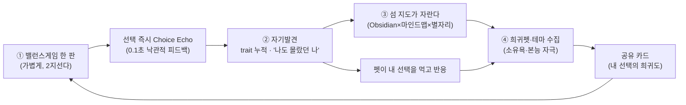
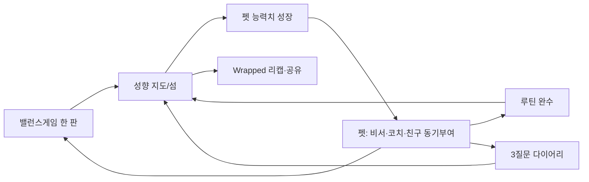

# Balance Island 업그레이드 계획서: "놀다 보니 나를 알게 되는 섬"

> **작성일:** 2026-06-04
> **작성자:** Claude Opus 4.8 (Deep Research + Synthesis)
> **문서 상태:** 기획 제안 (실행 대기)
> **인코딩 형식:** UTF-8
> **검토 대상:** `research.md`, `deep-research-report.md`, `docs/` 운영 문서 6건, 현재 `src/` 코드베이스
> **외부 리서치:** 웹검색, GitHub, Reddit/커뮤니티, 학술자료, 경쟁 앱 분석

---

## 0. 이 문서를 읽는 법

기존 6건의 리뷰 문서(`comprehensive-review`, `deep-research-product-upgrade-review`, `pet-island-liveops-upgrade-review`, `obsidian-integration-plan`, `product/deep-research-upgrade-decisions`)는 이미 매우 탄탄합니다. **이 문서는 그것들을 부정하지 않습니다.** 대신 두 가지를 더합니다.

1. **2026년 6월 시점의 외부 트렌드 신호**를 실제로 수집해서, 기존 계획 중 "지금 당장 밀어야 할 것"과 "미뤄도 되는 것"의 우선순위를 다시 매깁니다.
2. 사용자가 말한 4개 키워드 — **① 가볍게 즐기는 밸런스 게임 → ② 자연스러운 자기발견 → ③ Obsidian×마인드맵 직관 시각화 → ④ 본능·소유욕을 자극하는 희귀펫 수집** — 을 하나의 일관된 제품 서사로 묶는 **통합 비전과 실행 로드맵**을 제시합니다.

---

## 1. 핵심 진단: 지금 이 제품의 진짜 기회

리서치를 종합하면, 이 앱의 기회는 **빈 포지션을 정확히 차지하고 있다는 것**입니다.

| 시장에 이미 있는 것 | 빠져 있는 것 (= 우리 자리) |
|---|---|
| 밸런스게임 = 참여형 콘텐츠로 강세 (실시간 투표·숏폼 문법) | 밸런스게임이 **누적되어 "나"가 되는** 구조 없음 |
| 성향 테스트 = "한 번 보고 끝" (16Personalities, 푸망, 테스트잇) | **매일 조금씩 선명해지는** 동적 자기지도 없음 |
| 가상펫 = 강한 리텐션 엔진 (Finch 90일 234만 다운로드, 월 200만 달러) | 펫이 **내 선택을 먹고 반응하는** 인과 루프는 드묾 |
| 가챠 수집 = 강한 소유욕 엔진 | **윤리적이고 코스메틱 중심**인 수집은 희소 |
| Obsidian/마인드맵 = 지식 연결 시각화 | **모바일·게임화·자동생성**된 버전 없음 |

> **한 문장 포지셔닝:**
> "16Personalities의 공유력 + Finch의 정서적 리텐션 + 가챠의 소유욕 + Obsidian의 연결 시각화를, **밸런스게임 한 판으로** 묶은 유일한 앱."

이 조합을 한 제품에서 성공시킨 사례가 **아직 뚜렷하지 않다**는 점이 가장 큰 기회입니다. (근거: deep-research-report.md 경쟁 지형 분석 + 2026 외부 검색)

### 2026 트렌드가 우리 편인 이유 (외부 리서치 신호)

- **참여형·즉각반응형 콘텐츠 강세.** 일방향 시청보다 실시간 투표·2지선다 같은 즉시 반응 형식이 강세 → 밸런스게임 형식이 정확히 트렌드에 올라타 있음. (brunch 2026 밸런스게임 트렌드)
- **"희귀도 공개"가 바이럴 훅이 됨.** JobCannon은 "당신의 성격 조합이 전체에서 얼마나 희귀한지"를 보여주는 게 핵심 재미. Open Psychometrics의 "어떤 캐릭터인가" 퀴즈는 사이트 트래픽 대부분을 만드는 바이럴 엔진. → **"내 선택의 희귀도"** 가 우리 공유 카드의 핵심이 되어야 함.
- **가상펫 시장 급성장.** 2025년 15억 달러 → 2033년 50억 달러 전망. 펫은 "안 하면 죄책감"이라는 유일한 도덕적 출석 동기.
- **코지(cozy) 가챠 부상.** Heartopia처럼 가챠를 전투가 아니라 캐릭터 교감·꾸미기로 푸는 흐름. Stardew Valley식 "프리미엄 통화·FOMO 없는 늘 새로움". → 우리의 코스메틱·무료재화 중심 방향이 트렌드와 일치.
- **방치형(idle)의 부상.** 2026 한국 모바일 트렌드에서 방치형이 떠오름 → 펫/섬이 **접속 안 해도 조금씩 자라는** 비동기 성장 루프가 유효.

---

## 2. 통합 비전: 4개 키워드를 하나의 루프로

사용자가 원하는 4가지를 따로 만들면 "기능 4개"가 되지만, 하나의 인과 사슬로 묶으면 "경험 1개"가 됩니다.



> **모든 화면이 따라야 할 한 문장:**
> **"매일 2분 밸런스게임을 하면, 펫이 내 선택을 먹고 반응하고, 섬에 내 성향의 지형이 솟아오르고, 어느 날 문득 '나는 이런 사람이구나'를 발견하고, 그 발견이 희귀한 동반자로 손에 남는다."**

이때 **④ 수집(소유욕)** 은 단독 가챠가 아니라 **③ 자기발견의 보상으로 번역**되어야 합니다. "그냥 희귀한 펫"이 아니라 **"내 성향이 만들어낸, 나만의 희귀한 펫"** 이어야 소유욕이 자기서사와 결합해 훨씬 강해집니다. 이게 일반 가챠앱과의 결정적 차별점입니다.

---

## 3. 키워드별 업그레이드 설계

### ③-1. ① 밸런스게임: "가볍게"를 지키되 의미를 심는다

**원칙: 진입은 가볍게, 의미는 사후에.** 질문 자체는 0.5초 안에 고를 수 있어야 하고, 의미 부여는 선택 *후에* 얹습니다.

- **Choice Echo (이미 채택됨):** 투표 즉시 100ms 내 바텀시트. "즉흥 여행 선택 → 모험 +1.2, 흐름 +0.8 🐾 펫 반응". 낙관적 업데이트는 이미 결정됨(`deep-research-upgrade-decisions.md`). **유지·강화.**
- **오늘의 딜레마 테마 (신규 권장):** 매일 3~5문항을 한 축으로 묶기(월: 혼자vs같이 / 화: 안정vs모험…). → 같은 축을 연속으로 풀면 trait 변화가 **눈에 보이게** 쌓이고, 복귀 이유("오늘은 무슨 주제?")가 생김.
- **희귀도 즉시 노출 (신규·바이럴 훅):** Choice Echo에 **"이 선택을 한 사람은 전체의 12%"** 를 넣음. JobCannon·Open Psychometrics가 증명한 "희귀도가 곧 재미" 공식. 소수 선택일수록 "나 특이한 사람이네"라는 정체성 보상.
- **확신/고민 리액션:** A/B 선택에 "확신 / 고민" 보정을 받아 `confidence` 가중치로 사용(이미 research.md 알고리즘에 반영됨). 고민한 질문은 나중에 "가장 갈등한 질문"으로 리캡에 재활용.

### ③-2. ② 자기발견: "진단"이 아니라 "탐험"

리서치의 강한 경고: **의료적·진단적 표현 금지** (PIPC 민감정보 리스크 + MBTI 차용 법적 리스크). 이미 `deep-research-upgrade-decisions.md`에서 비진단 톤 채택됨.

- **비진단 언어 고정 (유지):** "당신은 X형" ❌ → "요즘 당신은 ~쪽이 진해지고 있어요" ✅. `productCopy.ts` 단일화 + 동적 템플릿 리터럴 함수화(리뷰 제안 채택).
- **"모순 발견" = 가장 강력한 aha (신규 권장):** 카테고리별로 상반된 성향을 **긍정적으로** 보여줌. "연애에선 80% 표현형인데 커리어에선 70% 차분형 → 일관성 없는 게 아니라, 사랑 앞에선 솔직하고 일할 땐 신중한 당신." 이게 "나도 몰랐던 나"의 핵심 체험. 현재 trait이 단일 벡터라면 **카테고리별 BIPI 분리 계산**이 선행 필요.
- **시간여행 (신규 권장):** "1개월 전의 나 vs 지금의 나" 비교. Personal Informatics 연구(Li et al., CHI 2010)의 "수집→통합→**성찰**" 중 대부분 앱이 못 가는 성찰 단계를 점유. 1년 단위로 가면 "내 선택의 1년" 앤니버서리 리캡.

### ③-3. ③ Obsidian × 마인드맵: "직관적"이 생명

가장 어려운 부분. Obsidian 그래프를 그대로 모바일에 옮기면 **복잡해서 망합니다.** 외부 리서치도 "조밀한 그래프엔 줌·팬과 노드 선택 시 관련 노드 하이라이트가 필수"라고 지적. 따라서 **3단계 점진 공개**가 핵심입니다.

| 보기 모드 | 메타포 | 인지 부하 | 역할 |
|---|---|---|---|
| **오늘의 발견** | 카드 1장 | 최저 | 매일 진입점. "오늘 나에 대해 알게 된 것" |
| **성향 지형 (섬)** | 공간적 지도 | 중 | 추상 그래프 대신 **섬 지리**로 표현 — 모험의 언덕↑, 안정의 마을, 둘 다 높으면 "균형의 다리" |
| **연결 지도 (별자리)** | 별자리 그래프 | 고(원할 때만) | Obsidian Local Graph를 별자리로 변환. 노드 탭 → 주변만 확대(semantic zoom) |

- **추상 노드-엣지 그래프를 첫 화면에 두지 말 것.** 기본은 "섬 지형"(공간적·직관적), 별자리(추상적)는 "더 보기"로 한 단계 숨김.
- **기술 스택 (리서치 종합):** MVP는 `react-native-svg` + `d3-hierarchy`(tree/cluster). 노드 탭 시 Obsidian식 로컬그래프 확대, `react-native-reanimated`로 전환. 60fps 별자리/네온 글로우 단계에서만 `react-native-skia`. (이미 `InsightGraphCanvas.tsx`에 네온 글로잉 구현됨 → 자산 활용)
- **"공간적 자기발견" = 차별점.** 숫자 대시보드가 아니라 **"내 선택이 풍경이 되는"** 경험. Obsidian Canvas의 공간 배치 + 마인드맵의 위계 + 게임의 성장감을 모바일에 맞게 융합.

### ③-4. ④ 희귀펫 수집: 본능·소유욕을 윤리적으로 자극

사용자가 명시한 "인간의 본능·욕심·소유욕". 이것을 **자기서사와 결합**하면 일반 가챠보다 강하고, **코스메틱·무료재화 중심**으로 하면 규제·윤리 리스크를 피합니다.

**소유욕을 자극하는 5가지 장치 (리서치 기반):**

1. **희귀도 4단계** Common 65~75 / Rare 20~25 / Epic 4~8 / Legendary 0.8~1.5%. "읽기 쉬운 구조" (research.md 채택값).
2. **천장(Pity) + 중복 보상:** 20회 내 Epic, 80회 내 Legendary 보장. 중복은 "산호 가루"로 자동 변환. → 분노 줄이고 신뢰 확보. **단, 학술 경고:** 천장 시스템은 도박 임계에 가까워질 수 있으므로 **유상 가챠가 아니라 무료재화 루프**에만 강하게 걸 것 (MVP는 유료 BM 보류 결정됨).
3. **"내 성향이 만든 펫" 서사:** 뽑기 결과를 "랜덤"이 아니라 "당신의 모험 성향이 강해서 ~펫을 만났어요"로 연결. 소유욕 + 정체성 = 훨씬 강한 애착.
4. **시즌 한정 + 재편입 신뢰:** "한정판은 사라지되 영원히 소실되진 않는다"(6~12개월 재편입). FOMO는 만들되 분노는 줄임.
5. **확률·천장 공시 UI 선제 도입 (이미 채택됨):** Apple/Google 모두 구매 직전 확률 공개 요구. `ThemeProbabilitySheet.tsx` 이미 존재 → 펫 가챠에도 확장.

**윤리 가드레일 (반드시):**
- 유상 랜덤상품을 핵심 경험에 연결하지 말 것 (Apple: NFT 소유가 앱 기능 언락 금지와 같은 맥락).
- 펫은 **스펙 우위 없이 표현 가치(섬 스킨·이펙트·말풍선·공유 프레임)** 만. 전투력 패키지 ❌.
- 미접속 복귀 시 항상 긍정 환영. "안 와서 아팠어" ❌ / "보고 싶었어" ✅.

---

## 4. 펫을 "살아있게" 만드는 다마고치 레이어

Finch의 교훈(행동→펫 에너지 인과 루프, 정서적 그리움)을 흡수합니다. 이미 `pet-island-liveops-upgrade-review.md`에 잘 설계됨 — 채택 권장:

- **펫 말풍선 반응:** 최근 trait streak 기반. "모험 3연속 ↑ → '오늘 새로운 거 해보고 싶은 기분이야!'". 템플릿 5~10개로 시작.
- **펫 일기:** 매일 밤 펫이 오늘의 선택으로 짧은 일기 작성 → `user_insight_cards`와 연결해 **펫이 인사이트를 전달하는 감성 채널**.
- **유기적 상태 변화:** 행복→졸림→외로움(미접속), 7일 연속 시 신남+보너스. **벌주지 않되 그립게.**

---

## 5. 데이터 스토리텔링 = 바이럴 엔진

Spotify Wrapped 공식("데이터를 돌려주면 자발적으로 공유한다"):

- **주간 리캡 (일요일):** "이번 주 23개 답함 / 가장 많은 성향: 흐름 / 가장 갈등한 질문 / 펫의 한마디". SNS 공유 이미지 자동 생성.
- **공유 카드 3종:** ①선택 카드("나는 초코칩 절대지킴이") ②관계 카드("우리 둘, 음식은 반대인데 여행 감성은 같음") ③섬 인사이트 카드. **카피 톤 = 장난기 70 + 통찰 30.**
- **희귀도를 공유 훅으로:** "내 이 선택, 전체의 7%" → 공유 동기 = 바이럴 = 신규 유입.

---

## 6. 우선순위 로드맵 (기존 단계 + 트렌드 재정렬)

> ⚠️ **대전제 (리서치 반복 경고):** 기능 추가보다 **기반 안정화가 먼저**. 멋진 섬은 모래 위에 지으면 예쁘게 무너진다. 아래 "Phase 0"를 건너뛰지 말 것.

### Phase 0 — 기반 토목공사 (출시 전 필수, 1~2주)
`comprehensive-review.md`의 즉시 항목. **이게 안 되면 나머지는 무의미.**
- [ ] `schema.sql`의 `DROP TABLE CASCADE` 운영 실행 차단 경고 + migration 추적 테이블
- [ ] AI Edge Function rate limit(`check_ai_rate_limit`) DB 적용 + 배포 + authenticated smoke test
- [ ] `handle_new_user` 이메일 없는 Kakao 사용자 회귀 검증
- [ ] 이미지 에셋 외부 Unsplash URL → Supabase Storage 자체 호스팅 전환 (S1 리스크)
- [ ] 모바일 딥링크(`balanceisland://auth/callback`) 실기기 QA (I2 리스크)

### Phase 1 — "섬이 나를 설명한다" (핵심 루프 완성)
- [x] Choice Echo (구현됨) → **희귀도 즉시 노출** 추가
- [ ] 오늘의 발견 카드 빈 상태 방어 (구현됨, 유지)
- [ ] 펫 말풍선 반응 (trait streak, 템플릿 5~10개)
- [ ] 오늘의 딜레마 테마 (요일별 축 묶기)

### Phase 2 — "직관적 자기지도" (③ 핵심)
- [ ] 섬 지형 모드(공간적) ↔ 별자리 모드(추상) 분리, 기본=지형
- [ ] semantic zoom (노드 탭 시 주변만 확대)
- [ ] 카테고리별 BIPI 분리 계산 → **"모순 발견" 인사이트 카드**

### Phase 3 — "소유욕 엔진" (④ 핵심)
- [ ] 펫 가챠 확률/천장/중복 공시 UI (`ThemeProbabilitySheet` 확장)
- [ ] "내 성향이 만든 펫" 서사 연결 문구
- [ ] 무료재화 루프(매일 1회 무료뽑기 + 주간 챌린지 티켓)
- [ ] 시즌 한정 + 재편입 규칙

### Phase 3.5 — 정서 + 바이럴
- [ ] 펫 일기 (하루 1개 자동 생성, 인사이트 연결)
- [ ] 주간 리캡 카드 + SNS 공유 이미지 자동 생성
- [ ] 시간여행 (1개월/3개월 전 비교)

### Phase 4 — 수익화 (리텐션 검증 후에만)
- [ ] 시즌 패스 · 유상 티켓 · 픽업 배너 · 브랜드 덱
- [ ] 리워드 광고(사용자 선택 지점에만: 추가 뽑기·즉시 완성·회고 열람)

---

## 7. 검증 KPI (운영 목표 밴드, deep-research-report.md 기준 유지)

| KPI | 목표 | 무엇을 검증하나 |
|---|---|---|
| 첫 인사이트 도달율 | 60%+ | 핵심 aha moment |
| D1 / D7 / D30 | 30~40 / 12~20 / 5~10% | 첫 보상 / 데일리 루틴 / 시즌·컬렉션 가치 |
| 공유 카드 생성율 | 15%+ | 바이럴 (희귀도 훅 효과) |
| 무료 뽑기 재방문율 | 25%+ | 소유욕 루프 체감 |
| 결제 전환율 | 1~3% | 코스메틱 MVP 현실 범위 |

**A/B 우선순위:** ①첫 인사이트 공개 시점(7표 vs 15표) ②무료뽑기 시점(즉시 vs 3일출석) ③희귀도 노출 유무가 공유율에 주는 영향 ④푸시 타이밍 ⑤카피 톤(재치 vs 통찰).

---

## 8. 법·윤리 체크리스트 (출시 전 필수, 리서치 반복 강조)

| 항목 | 기준 |
|---|---|
| **MBTI 차용 금지** | 4축/16유형 표기·공식 문구·MBTI® 표장 사용 금지. 자체 언어("성향 탐험·섬 기질")만 |
| **확률 공개** | 유상 랜덤상품 확률·천장·중복 규칙을 구매 직전 공시 (Apple/Google 필수) |
| **민감정보 제외** | 정치·종교·성적지향·건강 축을 분류체계에서 **아예 제외** (PIPC 집행 강도 높음) |
| **비진단 톤** | 의료·병리적 해석 문구 전면 금지 + "재미용 참고" 면책 |
| **UGC 가드** | (질문 생성 개방 시) 실명 외모평가 금지·신고/차단/숨김/단어필터·운영자 연락 경로 |
| **프라이버시** | 성향 데이터 기본 비공개, 공유는 사용자가 고른 요약 카드만 |

---

## 9. 한 페이지 요약 (의사결정용)

1. **포지션:** 밸런스게임 한 판으로 [공유력+정서 리텐션+소유욕+연결 시각화]를 묶은 유일한 앱. 시장 빈자리 존재.
2. **2026 트렌드가 우리 편:** 참여형 콘텐츠·희귀도 바이럴·가상펫 급성장·코지 가챠·방치형 부상 모두 우리 설계와 일치.
3. **차별의 핵심:** 수집(소유욕)을 **자기발견의 보상으로 번역** — "내 성향이 만든 나만의 희귀펫".
4. **시각화 원칙:** Obsidian 그래프를 그대로 옮기지 말 것. **섬 지형(직관) → 별자리(추상)** 점진 공개.
5. **순서:** 기반 토목공사(Phase 0) → 핵심 루프 → 자기지도 → 소유욕 엔진 → 정서/바이럴 → (검증 후)수익화.
6. **가드레일:** 비진단 톤 · 확률 공시 · 민감정보 제외 · 코스메틱 전용 가챠.

---

## 부록: 참조 소스 (2026-06-04 수집)

**경쟁/트렌드**
- Finch 분석 (Yu-kai Chou 펫 컴패니언): https://yukaichou.com/advanced-gamification/the-pet-companion-design-in-gamification/
- 가상펫 게임 시장 (Mistplay): https://www.mistplay.com/blog/10-best-virtual-pet-games-tamagotchi-sim-and-collection
- Heartopia 코지 가챠 2026: https://www.lemon8-app.com/@theninagabriella/7594861481460531767
- JobCannon vs Open Psychometrics (희귀도 게이미피케이션): https://jobcannon.io/blog/jobcannon-vs-open-psychometrics
- 2026 자기이해 앱 (Life Note/Day One/Stoic): https://blog.mylifenote.ai/best-apps-for-self-discovery-and-self-understanding-in-2026/
- 2026 밸런스게임 트렌드 (brunch): https://brunch.co.kr/@ceb47f8fba3b4ec/208
- 2026 한국 게임 트렌드 (방치형 부상): https://openads.co.kr/content/contentDetail?contsId=18690

**가챠/심리/윤리**
- 가챠 중독 심리 (gamenguide): https://www.gamenguide.com/articles/108013/20260515/why-gacha-games-are-so-addictive-psychology-rewards-player-behavior.htm
- 가챠 천장 시스템·도박 임계 (MDPI): https://www.mdpi.com/2078-2489/16/10/890
- 한국 모바일게임 수익화·리텐션 (arXiv): https://arxiv.org/pdf/2504.10714

**시각화 기술**
- Open MindMap (SVG 모바일 마인드맵): https://mindmap.u14.app/
- React 그래프 시각화 (Tom Sawyer): https://blog.tomsawyer.com/react-js-graph-visualization
- semantic zoom 그래프 (arXiv): https://arxiv.org/pdf/1906.05996
- d3-hierarchy / react-native-svg / react-native-skia (기존 리뷰 참조)

**학술/Obsidian**
- Personal Informatics Stage Model (Li et al., CHI 2010): https://www.cs.cmu.edu/~jhm/Readings/2010-ianli-chi-stage-based-model.pdf
- Obsidian Graph/Canvas: https://help.obsidian.md/plugins/graph , https://obsidian.md/canvas

---

## 10. 동반자 펫 · 루틴 · 다이어리 통합 (2026-06-04 추가)

> 사용자 방향: **"섬 = 나를 알아가는 공간, 펫 = 등급/레벨로 능력치가 다른 나의 비서·아바타·친구."** 펫이 동기부여를 하고, 하루의 좋았던 일·아쉬웠던 일·기억에 남은 일을 가볍게 물어 다이어리처럼 쓰면 그 기록이 섬에 정보로 쌓이고, 펫이 루틴(루티너리) 코치 역할까지 한다.

### 10.1 외부 리서치 요약 (2026-06-04)

| 앱 | 핵심 메커닉 | 우리가 가져올 것 |
|---|---|---|
| **Routinery** (Apple 2026 올해의 앱, ADHD 베스트) | 루틴을 단계별로 **음성 가이드 타이머**로 안내(일시정지/스킵/자동진행), 요일·시간 스케줄, streak로 자라는 식물 배지 | 펫이 **루틴을 단계별로 코칭**하는 동반자 역할 |
| **Otto** | 펫이 **할 일 완료로 속성(attribute)을 얻고 진화**, 탐험으로 아이템 발견 | 행동(루틴/투표) → **펫 능력치 성장** 인과 |
| **Finch** | 셀프케어 행동 → 펫 에너지 → 모험, 정서적 그리움으로 복귀 | 비처벌·정서형 동기부여 톤 |
| **Rosebud** | 매일 저녁 **3가지 질문(Rose/Bud/Thorn)** + AI 후속질문, 5분 회고 | **펫이 묻는 3질문 다이어리** → 섬 데이터로 적층 |
| **HabitYou/Motion** | 습관으로 펫 레벨업, 랭크 상승 시 새 펫 해금 | 등급/레벨 기반 수집·해금 |

핵심 통찰: 위 앱들은 각각 **루틴(Routinery)·동기펫(Otto/Finch)·회고(Rosebud)** 중 하나에 특화돼 있다. **셋을 "나의 섬"이라는 하나의 자기지도로 모으는** 제품은 비어 있다 — 이것이 우리 자리.

### 10.2 펫 = 등급/레벨별 능력치를 가진 "비서·친구"

펫은 전투용 스펙이 아니라 **자기성장을 돕는 비서 능력(편의·표현)**을 등급/레벨로 가진다. (윤리 가드: pay-to-win 금지, 핵심 자기발견·기본 루틴·다이어리는 무과금 풀 접근)

**동반자 스탯(4종, 행동으로 성장):**
- 🤝 **친밀도(Bond)** — 함께한 일수/상호작용. 높을수록 말투가 친근, 더 개인화된 코멘트.
- ⚡ **활력(Energy)** — 최근 케어/참여. 낮으면 펫이 쉬자고 권유(번아웃 방지).
- 🔮 **통찰(Insight)** — 누적 선택/다이어리. 높을수록 **인사이트 요약을 더 깊게** 제공.
- 🎯 **끈기(Discipline)** — 루틴 완수율. 높을수록 **루틴 코칭/리마인드 능력** 강화.

**등급/레벨 → 비서 능력 해금(예시, 모두 편의·표현):**
| 단계 | 해금 능력 |
|---|---|
| Common Lv↑ | 아침 브리핑 1줄, 저녁 회고 알림 |
| Rare | 루틴 **음성/단계 코칭**, 다이어리 후속질문 +1 |
| Epic | **주간 리캡 자동 요약**, 모순 발견 코멘트 |
| Legendary | 시즌 회고 내레이션, 펫 고유 페르소나 보이스 |

> **수집 가치 = "어떤 비서와 함께할까".** 등급/종에 따라 코칭 말투·성격(persona)이 달라, 능력치가 곧 "내 곁의 동반자 선택"이 된다. 능력은 자기발견을 *가속*할 뿐, 막지 않는다.

### 10.3 데일리 다이어리 (펫이 묻는 3질문) → 섬에 적층

Rosebud식 **Rose/Bud/Thorn**을 펫의 목소리로 가볍게:
- 🌹 **오늘 좋았던 일** (Rose)
- 🌧 **아쉬웠던 일** (Thorn)
- 🌱 **기억에 남은 / 기대되는 일** (Bud)

설계 원칙:
1. **저마찰**: 3질문, 각 한 줄. 건너뛰기 자유. 펫이 후속질문 1개(통찰 스탯에 따라)만 부드럽게.
2. **섬에 데이터로 적층(사용자 요청 직접 구현)**: 다이어리 답이 **섬 지형/별자리에 "기억 조각" 노드**로 쌓여, 단순 기록이 아니라 *자기이해 지도의 입력*이 된다. (예: 반복되는 Thorn 키워드 → 인사이트 카드로 승격)
3. **펫 일기와 연결**: 이미 만든 `PetDiaryCard`가 사용자의 3질문 답을 받아 펫의 시선으로 되돌려준다(감성 채널).
4. **프라이버시(중요)**: 다이어리는 민감정보 → 기본 비공개·로컬/암호화, 공유는 사용자가 고른 요약 카드만. (research.md PIPC 경고 연계, 민감 축 분류 제외 유지)

### 10.4 펫 = 루틴(루티너리) 코치

- 사용자가 만든 루틴(예: 아침 루틴 = 물 한 잔 → 스트레칭 → 명상)을 펫이 **단계별 타이머로 안내**(Routinery 차용), 동기 멘트로 응원.
- **행동 → 자기발견 연결(우리만의 차별)**: 루틴 완료가 **섬 zone 성장 + trait 반영**으로 번역된다. 예: '명상 루틴' 완수 → 안정/차분 trait↑ → 안정의 마을 성장. 즉 *루틴(행동)·투표(놀이)·다이어리(기록)*가 모두 같은 성향 지도로 모인다.
- 루틴 완수율 → 펫 **끈기 스탯**↑ → 코칭 능력 해금(선순환).

### 10.5 통합 루프 (갱신)



### 10.6 데이터 모델 스케치 (서버 핸드오프)

```sql
-- 동반자 스탯
pet_stats(user_id, bond, energy, insight, discipline, updated_at)
-- 능력 해금(등급/레벨 게이트)
pet_abilities(slug, min_rarity, min_level, kind)  -- 'voice_coach','recap_summary',...
-- 루틴
routines(id, user_id, title, schedule)
routine_steps(id, routine_id, label, duration_sec, sort_order)
user_routine_logs(id, user_id, routine_id, completed_at, trait_effects jsonb)
-- 다이어리(Rose/Bud/Thorn)
daily_journal_entries(id, user_id, entry_date UNIQUE, rose, thorn, bud, mood, created_at)
-- 섬 적층: 다이어리/루틴 → island_zones·insight 노드로 반영(기존 trait 파이프라인 확장)
```

### 10.7 로드맵 편입

- **Phase 3 (소유욕) 확장**: 펫 등급/레벨 → **비서 능력 해금** 테이블(`pet_abilities`) + 스탯(`pet_stats`).
- **Phase 3.5 (정서) 확장**: 현 `PetDiaryCard`를 **입력형 3질문 다이어리**로 승격 → 섬 적층.
- **신규 Phase 4.0 "동반자·루틴"**: 루틴 빌더 + 단계 타이머 코칭 + 루틴→trait 반영. (수익화 Phase 이전, 리텐션 코어로 우선)

### 10.8 내가 더하는 아이디어 (요약)

1. **능력 = "도움"의 메타포** — 등급↑는 더 센 펫이 아니라 *더 잘 돕는 비서*. 윤리적이고 차별적.
2. **다이어리가 지도가 된다** — 기록을 "기억 조각 노드"로 섬에 적층해 자기이해의 입력으로 재활용(단순 일기 앱과의 결정적 차이).
3. **행동·놀이·기록의 삼위일체** — 루틴(행동)·밸런스(놀이)·다이어리(기록)가 **하나의 성향 지도**로 수렴.
4. **등급별 페르소나** — 수집 동기를 "스펙"이 아니라 "어떤 성격의 동반자와 함께할까"로 전환.
5. **번아웃 가드** — 활력 낮으면 펫이 쉬자고 권하는 비처벌 설계(Finch 교훈).

### 10.9 가드레일 (추가분)

- **Pay-to-win 금지**: 자기발견·기본 루틴·다이어리는 무과금 풀 접근. 펫 능력은 편의·표현 가속만.
- **민감정보**: 다이어리 본문은 기본 비공개·암호화, 민감 축 분류 제외 유지(PIPC).
- **비진단·비처벌 톤** 유지, 미접속 복귀는 항상 환영.

### 10.10 참조 (이 절)

- Routinery: https://www.routinery.app/
- Otto (Daily Tasks Virtual Pet): https://apps.apple.com/us/app/otto-daily-tasks-virtual-pet/id6677016305
- Finch: https://apps.apple.com/us/app/finch-self-care-pet/id1528595748
- Rosebud (AI Journal, Rose/Bud/Thorn): https://www.rosebud.app/
- Rose/Bud/Thorn 프레임워크: https://www.panoramaed.com/blog/rose-bud-thorn-activity-and-worksheet
- HabitYou / Motion (펫 레벨업·랭크): https://apps.apple.com/us/app/habit-tracker-n-pets-habityou/id6473684904 , https://motion-app.com/digital-fitness-pets/

> 이 문서는 UTF-8로 인코딩되어 있습니다.
