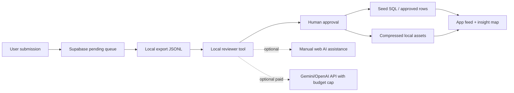

# Zero-Cost AI Operations Implementation Plan

> **For agentic workers:** REQUIRED SUB-SKILL: Use `superpowers:subagent-driven-development` or `superpowers:executing-plans` to implement this plan task-by-task. Steps use checkbox (`- [ ]`) syntax for tracking.

**Goal:** Balance Island를 1인 개발자가 최대한 0원에 가깝게 운영하면서도, 성향 분석용 밸런스 질문 은행과 관리자 검수 파이프라인을 안전하게 키운다.

**Architecture:** 유저가 볼 때는 Supabase + Expo 앱이 즉시 동작하고, 비용이 드는 AI 분석/이미지 생성은 실시간 호출하지 않는다. 질문 수집, 의도 분석, trait 매핑, 이미지 생성은 로컬 PC의 배치 작업과 사람 승인으로 처리하고, 외부 API는 예산 잠금이 걸린 선택 옵션으로만 둔다.

**Tech Stack:** Expo Router, Supabase Auth/Postgres/RPC/Edge Functions, local JSONL/SQL seed files, local Playwright for QA/admin assistance only, optional Gemini/OpenAI API fallback with hard budget caps.

---

## 결론

현재 프로젝트 방향은 **AI를 유저 요청마다 호출하는 앱**이 아니라 **많은 밸런스 질문을 미리 수집하고, 그 질문에 성향 벡터를 붙여두는 앱**으로 운영해야 비용이 가장 낮다.

사용자가 질문을 올리면 바로 AI가 처리하지 않는다. 먼저 `questions.status = 'pending'` 또는 별도 승인 큐에 쌓고, 관리자가 로컬 PC에서 주 1~2회 배치로 검수한다. 로컬 도구가 Gemini/ChatGPT 웹 화면을 Playwright로 조작하는 방식은 비용을 줄일 수는 있지만, 약관/캡차/계정 제한/화면 변경에 취약하므로 **운영 필수 파이프라인이 아니라 보조 도구**로만 둔다.

꼭 돈이 들 수 있는 지점은 도메인, Supabase/Vercel 무료 한도 초과, 앱스토어 배포비, 그리고 실시간 AI/API 호출이다. 이 중 초기에는 도메인도 선택 사항이고, AI/API는 기본 OFF로 두면 월 고정비 0원에 가깝게 갈 수 있다.

## 라이브 검증 기반 개선 (2026-06-04 갱신)

> Supabase MCP로 라이브 프로젝트(`balance`, ztcexgnelqtdzinfgoja)와 wiki(BIPI 모델)를 대조해 이 계획을 갱신했다. 아래가 가장 중요한 변경이다.

### A. 라이브 상태가 이 계획을 이미 뒷받침함 (좋은 소식)

- **Edge Function 미배포 = 현재 이미 $0.** `refine-question`/`embed-question`는 repo에만 있고 **라이브 배포 안 됨** → 지금 외부 AI 호출 0, 비용 0. (R1의 "비활성" 목표가 사실상 현재 기본 상태)
- **durable rate-limit DB는 이미 라이브.** `ai_edge_rate_limit_events` + `check_ai_rate_limit()` 존재 → 추후 배포 시 즉시 작동.
- **승인 큐 토대 일부 존재.** `questions.status`가 이미 있고 `submit_vote`/피드 RPC가 `status='approved'`만 노출한다 → **Task 2는 status를 새로 만들 필요 없이 "제출 = pending INSERT RPC"만 추가**하면 된다.
- **인사이트는 전부 결정론적 SQL RPC = LLM 비용 0.** `get_personality_insight_graph`, `refresh_user_insight_cards`, `compute_user_trait_contradictions` 모두 LLM 없이 동작 → "deterministic over LLM" 원칙이 **이미 구현됨**. 이게 zero-cost 운영의 핵심 자산이므로 계획의 기본 가정으로 명시한다.

### B. [Critical] trait 키 체계 불일치 — 반드시 수정

계획의 JSONL/룰북이 쓰는 trait 키가 **라이브 표준과 다르다.** 이대로 시드하면 insight map과 모순 함수가 인식하지 못해 점수·라벨이 깨진다.

- **라이브 canonical (`question_traits` 실측 9키):** `safe, adventure, plan, flow, solo, social, calm, express, comfort`
- **BIPI 4축(wiki):** solo↔social · safe↔adventure · plan↔flow · calm↔express

**매핑 표 (계획의 임의 키 → canonical):**

| 계획에 쓰인 키 | canonical |
|---|---|
| `stability_seeker`, `security_oriented` | `safe` |
| `novelty_seeker`, `risk_taker` | `adventure` |
| `planner` | `plan` |
| `spontaneous`, `autonomy_seeker` | `flow` |
| `introversion`, `self_recharge` | `solo` |
| `social_recharge`, `connection_seeker` | `social` |
| `comfort_seeker` | `comfort` |
| `express`, `calm` | (그대로) |

→ **Task 3 검증 스크립트는 canonical 9키만 화이트리스트 허용**하고 그 외 키는 reject. 시드·룰북 예시도 canonical 키로 교체한다(본 문서에서 정정).

**추가 드리프트:** 라이브에도 불일치가 있다 — `pet_species_traits`는 `comfort_seeker`/`planner`를, `question_traits`는 `comfort`/`plan`을 쓴다. **한 세트(canonical)로 정규화**하는 마이그레이션을 별도 task로 둔다(`pet_species_traits.comfort_seeker→comfort`, `planner→plan`).

### C. 보안 — 관리자/서비스 키 취급 (라이브에서 실제 취약점 발견·수정함)

- 2026-06-04 security advisor에서 `apply_shell_delta` 등 내부 `SECURITY DEFINER` 함수가 **anon 호출 가능(임의 계정 셸 무한발급)** 취약점을 확인하고 즉시 차단했다(`202606040600_harden_internal_function_execute.sql`).
- **교훈을 Task 2/5에 반영:** 새 제출 RPC는 `SECURITY DEFINER` + `auth.uid()` 가드 + **anon/PUBLIC EXECUTE 회수**. 관리자 배치는 service key를 **로컬 `.env.local`(gitignore)** 에만 두고, 절대 클라이언트/`EXPO_PUBLIC_*`/repo에 두지 않는다.
- **운영 체크리스트:** DDL 적용 후 매번 `get_advisors(security)` 실행.

### D. 환경변수 위치 정정

`AI_PIPELINE_MODE` / `AI_MAX_DAILY_USD` / `AI_ALLOW_PUBLIC_REQUESTS`는 **Supabase Edge Function 시크릿(대시보드/CLI)** 이다. **`EXPO_PUBLIC_*`로 두면 클라이언트 번들에 노출**되므로 금지. `.env.example`엔 문서용 주석으로만 적고 실제 값은 Supabase secrets에 설정한다.

### E. 마이그레이션 현황 메모

repo 마이그레이션은 `202606040600`까지 존재하고 Supabase가 **네이티브로 마이그레이션을 추적**한다. 커스텀 `public.schema_migrations` 테이블은 불필요하므로 새 task에서 그것에 의존하지 않는다(Task 2의 새 migration도 끝에 커스텀 INSERT를 넣지 않는다).

## 공식 비용 근거

- [Supabase Pricing](https://supabase.com/pricing): Free 플랜은 DB 500 MB, Storage 1 GB, egress 5 GB, 50,000 MAU, Edge Functions 500,000 invocations가 포함된다. Pro는 월 $25부터이며, 무료 프로젝트는 비활성 시 pause될 수 있다.
- [Vercel Pricing](https://vercel.com/pricing): Hobby는 개인/시작 프로젝트에 무료로 제공되고, Pro는 월 $20부터다. 무료 한도에는 네트워크, Blob, 함수, 이미지 최적화 등 사용량 제한이 있으므로 앱 이미지는 가능한 정적 번들/압축 자산으로 둔다.
- [Gemini Developer API Pricing](https://ai.google.dev/gemini-api/docs/pricing): 무료 구간은 모델별 제한과 rate limit이 있고, 무료 구간의 콘텐츠는 제품 개선에 사용될 수 있다. Paid tier는 토큰/이미지/검색 grounding 비용이 발생한다.
- [Google Flow credits](https://support.google.com/flow/answer/16526234?hl=en): 비구독자는 Google Flow 무료 체험 크레딧을 받을 수 있지만, 운영 이미지 파이프라인 전체를 감당할 수준으로 전제하면 안 된다.
- [OpenAI API Pricing](https://openai.com/api/pricing/): API는 ChatGPT 구독과 별도 과금이다. 현재 `refine-question`, `embed-question` Edge Function 구조는 OpenAI API 키가 설정되면 트래픽에 따라 비용이 발생한다.

## 운영 원칙

1. **AI 호출은 기본 OFF**
   - 앱 클라이언트에서 OpenAI/Gemini를 직접 호출하지 않는다.
   - Edge Function AI 호출은 `AI_PIPELINE_MODE=api`가 명시적으로 설정된 경우에만 허용한다.
   - 기본값은 `AI_PIPELINE_MODE=manual`이다.

2. **질문은 미리 많이 모으고, 분석은 결정론적으로 처리**
   - 밸런스 질문마다 `category`, `tags`, `question_traits`를 미리 붙인다.
   - 사용자의 성향 분석은 투표 결과와 trait weight 합산으로 계산한다.
   - LLM은 “질문 문장 다듬기/trait 후보 제안”까지만 쓰고 최종 반영은 사람이 승인한다.

3. **이미지는 생성 후 캐시**
   - 매번 이미지 생성 API를 호출하지 않는다.
   - 질문 A/B 이미지는 로컬 PC에서 생성/선별 후 768x768 WebP 또는 PNG로 압축한다.
   - 앱에는 정적 asset 또는 자체 호스팅 URL만 저장한다.
   - Unsplash 같은 외부 URL은 장기 운영용 원본으로 쓰지 않는다.

4. **로컬 Playwright는 QA/관리 보조만**
   - 로컬 브라우저 자동화는 앱 테스트, 관리자 페이지 입력 보조, 스크린샷 검증에는 사용한다.
   - ChatGPT/Gemini/Google Flow 웹 UI를 자동 조작하는 방식은 계정/약관/캡차/화면 변경 리스크가 있으므로 프로덕션 자동화로 문서화하지 않는다.
   - 불가피하게 개인 작업 보조로 쓸 때도 사람 확인, 낮은 빈도, 결과 캐시, 민감정보 제거를 필수로 둔다.

5. **돈이 드는 기능은 출시 후 증거가 생길 때만 켠다**
   - 사용자가 실제로 반복 방문하고 질문 은행이 부족해지는 시점 전까지 실시간 AI를 켜지 않는다.
   - 비용 지출 조건은 “주간 활성 사용자, 승인 대기 질문 수, 수동 처리 시간” 지표로 판단한다.

## 현재 코드 기준 위험 진단

### R1. OpenAI Edge Function 비용 폭발 위험

`supabase/functions/refine-question/index.ts`와 `supabase/functions/embed-question/index.ts`는 OpenAI API 호출 전제다. durable rate limit은 있지만, 사용자가 늘면 호출 횟수만큼 외부 API 비용이 생긴다.

**결정:** 이 두 함수는 초기 운영에서 비활성 또는 관리자 전용으로 둔다. 공개 앱에서 자동 호출하지 않는다.

### R2. `aiService.ts` 한글 깨짐과 더미 응답

`src/services/aiService.ts`는 현재 더미 응답이고 한국어 문자열이 깨져 있다. 이 상태에서 사용자 제출 흐름에 연결하면 품질과 신뢰도가 떨어진다.

**결정:** 초기 구현에서는 AI 정제 서비스를 사용자-facing 기능으로 노출하지 않는다. 먼저 로컬 승인 큐와 seed question 업로드를 완성한다.

### R3. Supabase 무료 한도 관리

Free 플랜은 초기에는 충분하지만 DB 500 MB, Storage 1 GB, egress 5 GB가 작다. 이미지 파일을 Supabase Storage에 많이 넣으면 무료 한도를 빠르게 소모할 수 있다.

**결정:** 질문 이미지 원본은 로컬에 보관하고, 앱에는 압축된 최종본만 올린다. 가능하면 Expo/Vercel 정적 자산 또는 작은 Supabase Storage bucket을 사용한다.

### R4. 외부 이미지 URL 권리/안정성

현재 seed/Edge Function fallback에 Unsplash URL이 남아 있다. 외부 URL은 라이선스, 차단, hotlink, 이미지 변경 리스크가 있다.

**결정:** 승인된 질문은 반드시 자체 보유 이미지로 치환한다. 외부 URL은 임시 초안에만 허용한다.

### R5. Playwright 웹 AI 자동화 리스크

사용자가 말한 “스트로크 + Playwright” 방식은 비용은 줄일 수 있지만, 외부 서비스 화면 자동 조작은 약관 위반 가능성, UI 변경, 로그인 만료, 캡차, 계정 제한이 있다.

**결정:** 앱 운영의 핵심 처리에는 사용하지 않는다. 대신 로컬 관리자 콘솔에서 “복사/붙여넣기 보조”, “결과 JSON 검증”, “스크린샷 QA” 같은 낮은 위험 작업에 쓴다.

## 목표 운영 구조



## 데이터 전략

### 질문 은행

질문은 `questions`와 `question_traits`를 중심으로 관리한다.

**승인 상태:**
- `pending`: 사용자가 제출했거나 로컬 배치 후보.
- `approved`: 앱 피드에 노출 가능.
- `rejected`: 중복, 저품질, 위험 콘텐츠.

**질문 1개에 필요한 최소 메타데이터:**
- `title`
- `option_a_title`, `option_b_title`
- `category_id`
- `tags`
- `question_traits`: A/B 각각 최소 1개 trait.
- `option_a_image_url`, `option_b_image_url`: 최종 압축 이미지 URL 또는 asset key.

### 성향 분석

초기에는 embedding 기반 중복 탐지보다 deterministic trait scoring을 우선한다.

**이유:**
- embedding은 외부 API 또는 로컬 모델 운영이 필요하다.
- 성향 분석의 핵심 가치는 “유저가 고른 선택과 연결된 trait 해석”이지 실시간 LLM 답변이 아니다.
- 질문 은행이 잘 설계되어 있으면 LLM 없이도 MBTI처럼 직관적인 결과를 줄 수 있다.

## 이미지 전략

### 기본 원칙

- 앱용 이미지는 768x768 기준으로 정규화한다.
- 배경 투명화가 필요한 것은 펫/아이템/스티커류이고, 밸런스 질문 이미지는 카드 안에 들어가는 장면형 이미지라 투명 배경이 필수는 아니다.
- 질문 이미지는 JPG/WebP 우선, 펫/아이템은 PNG/WebP 투명 배경 우선이다.

### Flow 사용 판단

Google Flow 무료 크레딧은 “초기 시안 생성” 용도로만 쓴다. 운영상 필요한 모든 이미지를 무료 Flow로 안정적으로 공급한다고 가정하지 않는다.

**대안 순서:**
1. 기존 보유 이미지/펫 asset 재가공.
2. 직접 생성한 이미지를 로컬에 저장하고 압축.
3. 무료 크레딧 기반 Flow/Whisk 수동 생성.
4. 꼭 필요한 경우에만 paid image API 또는 유료 구독 1개월 집중 사용.

## 비용 발생 지점

| 항목 | 초기 필요성 | 비용 위험 | 결정 |
|---|---:|---:|---|
| Supabase Free | 필수 | 낮음 | 사용. DB/Storage/egress 모니터링 |
| Vercel Hobby | 웹 배포 시 필수 | 낮음 | 개인 프로젝트 기준 사용 |
| OpenAI API | 선택 | 높음 | 기본 OFF, 관리자 전용 fallback |
| Gemini API | 선택 | 중간 | 무료 tier 테스트 가능, 개인정보/데이터 사용 조건 주의 |
| Google Flow | 선택 | 중간 | 무료 크레딧은 시안용, 운영 의존 금지 |
| 도메인 | 선택 | 낮음 | 출시 전까지 보류 가능 |
| Apple Developer | iOS 출시 시 필수 | 고정비 | 웹/PWA 검증 후 결정 |
| Google Play Console | Android 출시 시 선택 | 일회성 | 웹/PWA 검증 후 결정 |
| SMS 인증 | 불필요 | 높음 | 사용 금지. 이메일/OAuth만 |
| Sentry/유료 Analytics | 선택 | 중간 | 콘솔/무료 로그로 시작 |

## 최소 비용 실행 계획

### Task 1: AI 비용 차단 스위치 문서화

**Files:**
- Modify: `.env.example`
- Modify: `docs/2026-06-04-phase0-foundation-handoff.md`
- Modify: `src/services/aiService.ts`

- [ ] **Step 1: 환경 변수 규칙 추가**

`.env.example`에 다음 값을 추가한다.

```env
AI_PIPELINE_MODE=manual
AI_MAX_DAILY_USD=0
AI_ALLOW_PUBLIC_REQUESTS=false
```

- [ ] **Step 2: `aiService.ts`에 한국어 안전 오류 반환**

`AI_PIPELINE_MODE !== 'api'`일 때는 외부 API 호출을 시도하지 않고 “관리자 검수 대기” 상태를 반환한다.

- [ ] **Step 3: 검증**

```bash
npm run typecheck
npm run validate:wiki
```

Expected: both pass.

### Task 2: 사용자 질문 제출을 승인 큐로 고정

**Files:**
- Modify: `src/app/(tabs)/create.tsx`
- Modify: `src/services/questionService.ts`
- Create: `supabase/migrations/202606041900_question_submission_queue.sql`

- [ ] **Step 1: 제출 버튼은 즉시 공개하지 않기**

사용자 질문은 `status = 'pending'`으로 저장한다. 앱 피드 RPC는 기존처럼 `approved`만 보여준다.

- [ ] **Step 2: 게스트/비로그인 제출 처리**

초기에는 비로그인 사용자의 질문 제출은 로컬 미리보기까지만 허용한다. 서버 저장은 로그인 사용자만 허용한다.

- [ ] **Step 3: 운영 로그**

제출 성공 시 관리자 검수 대기 안내만 표시한다. AI 정제 완료처럼 보이는 문구를 쓰지 않는다.

- [ ] **Step 4: 안전한 제출 RPC (보안 교훈 반영)**

`questions.status`는 이미 라이브에 존재하므로 컬럼을 새로 만들지 않는다. 제출은 새 RPC `submit_user_question(...)`로 처리하되:
- `SECURITY DEFINER` + 함수 첫 줄에서 `IF auth.uid() IS NULL THEN RAISE EXCEPTION` (로그인 필수).
- 항상 `status='pending'`, `created_by = auth.uid()`로 INSERT.
- 일일 제출 수 제한(예: `check_ai_rate_limit` 패턴 재사용 또는 간단 카운트).
- **`REVOKE EXECUTE ... FROM anon, PUBLIC; GRANT ... TO authenticated;`** — `apply_shell_delta` 취약점과 같은 유형(내부/민감 함수의 공개 노출)을 반복하지 않는다.
- migration 파일 끝에 커스텀 `schema_migrations` INSERT를 넣지 않는다(Supabase 네이티브 추적).

### Task 3: 로컬 질문 은행 배치 포맷 만들기

**Files:**
- Create: `docs/question-bank-format.md`
- Create: `data/question-bank/sample.questions.jsonl`
- Create: `scripts/validate-question-bank.mjs`

- [ ] **Step 1: JSONL 스키마 정의**

```json
{"title":"평생 한 음식만 먹는다면?","category_slug":"food","option_a_title":"김치찌개","option_b_title":"초밥","tags":["취향","음식"],"traits":[{"option_side":"A","trait_key":"comfort","weight":1.2},{"option_side":"B","trait_key":"adventure","weight":1.2}]}
```

- [ ] **Step 2: 검증 스크립트**

검증 조건은 다음으로 고정한다.
- A/B option 모두 존재.
- trait는 A/B 양쪽 최소 1개.
- **trait_key는 canonical 9키(`safe, adventure, plan, flow, solo, social, calm, express, comfort`)만 허용**(화이트리스트). 그 외 키는 reject (위 매핑 표 참고).
- weight는 0.5~2.0.
- title은 160자 이하.
- 금지어/개인정보/혐오 표현 후보는 `needs_review`로 표시.

- [ ] **Step 3: SQL seed 변환은 별도 task로 분리**

검증을 통과한 JSONL만 SQL seed로 변환한다.

### Task 4: 이미지 파이프라인을 로컬 캐시 중심으로 정리

**Files:**
- Create: `docs/image-pipeline.md`
- Create: `assets/feed/README.md`
- Create: `scripts/validate-feed-images.mjs`

- [ ] **Step 1: 이미지 타입 규칙**

질문 카드 이미지는 768x768 WebP 또는 JPG, 펫/아이템은 투명 PNG/WebP를 기본으로 한다.

- [ ] **Step 2: 파일명 규칙**

```text
assets/feed/<category>/<question-slug>-a.webp
assets/feed/<category>/<question-slug>-b.webp
```

- [ ] **Step 3: 검증**

이미지 크기, 용량, 확장자, A/B 쌍 존재 여부를 검사한다.

### Task 5: 로컬 관리자 배치 도구

**Files:**
- Create: `scripts/admin/export-pending-questions.mjs`
- Create: `scripts/admin/import-approved-questions.mjs`
- Create: `docs/admin-review-workflow.md`

- [ ] **Step 1: pending export**

Supabase에서 `pending` 질문을 JSONL로 내려받는다. 서비스 키는 로컬 `.env.local`에만 둔다.

- [ ] **Step 2: 관리자 검수**

관리자는 질문의 의도, 선택지 균형, 성향 trait, 이미지 필요 여부를 검토한다.

- [ ] **Step 3: approved import**

승인된 질문만 `approved`로 업데이트하고, trait와 이미지 URL을 함께 반영한다.

### Task 6: 외부 AI fallback을 월 0원 기본값으로 유지

**Files:**
- Create: `docs/ai-fallback-policy.md`
- Modify: `supabase/functions/refine-question/index.ts`
- Modify: `supabase/functions/embed-question/index.ts`

- [ ] **Step 1: 공개 호출 차단**

`AI_ALLOW_PUBLIC_REQUESTS=false`면 일반 유저 토큰으로 AI Edge Function 호출을 거절한다.

- [ ] **Step 2: 일일 비용 상한**

`AI_MAX_DAILY_USD=0`이면 외부 API 호출을 거절한다. 값이 1 이상일 때만 관리자 요청을 허용한다.

- [ ] **Step 3: 캐시 우선**

같은 질문/선택지 조합은 기존 정제 결과를 재사용한다.

## 의사결정 기준

### 언제까지 무료 운영을 유지하나

아래 조건 중 하나가 생기기 전까지 무료 운영을 유지한다.

- 승인 대기 질문이 주 200개를 넘고 수동 처리 시간이 주 5시간을 넘는다.
- Supabase DB가 350 MB를 넘는다.
- Supabase Storage가 700 MB를 넘는다.
- Vercel bandwidth가 무료 한도의 70%를 넘는다.
- 이미지 생성이 앱 출시 속도를 막고, 1개월 유료 구독으로 해결 가능한 명확한 backlog가 있다.

### 언제 외부 API를 켜나

외부 API는 다음 조건을 모두 만족할 때만 켠다.

- 유저에게 직접 과금 가치가 있거나, 운영 시간을 확실히 줄인다.
- 같은 결과를 캐시해서 재사용할 수 있다.
- 하루/월 비용 상한이 코드와 대시보드 양쪽에 있다.
- 관리자 승인 없이 공개 피드에 반영되지 않는다.

## 당장 하지 않을 것

- 유저 투표마다 LLM으로 성향 해석 생성.
- Google Flow/ChatGPT/Gemini 웹 UI 자동화를 프로덕션 처리기로 사용.
- Supabase Storage에 원본 대용량 PNG를 대량 업로드.
- SMS 인증.
- 유료 analytics/Sentry/monitoring 도입.
- 앱스토어 배포 전 Apple/Google 개발자 계정 결제.

## 리뷰어 반영 사항

GPT-5.3-Codex-Spark 읽기 전용 리뷰어가 지적한 항목 중 타당한 내용만 반영했다.

- AI 질의 정제/검수 파이프라인은 현재 사용자-facing 완성 기능이 아니므로 기본 OFF.
- Supabase 질문 수집/RPC 흐름은 승인 큐와 명시적 상태 전환으로 보강.
- OpenAI Edge Function은 비용 상한, 공개 호출 차단, 캐시 우선 정책 필요.
- CORS/Origin은 배포 도메인 변경 시 운영 체크리스트에 포함.
- `aiService.ts`, `questionService.ts`의 깨진 한국어 메시지는 별도 품질 task로 처리.
- `schema.sql`은 dev reset 용도로만 유지하고 실서비스는 migrations만 사용.
- 외부 이미지 URL은 자체 보유/압축 이미지로 치환.
- Playwright 기반 외부 웹 조작은 운영 필수 경로에서 제외.

## 성공 기준

- 신규 유저가 밸런스 질문을 풀고 성향 섬/마인드맵을 보는 데 외부 AI API 호출이 0회다.
- 질문 100개를 seed로 추가해도 월 고정비가 증가하지 않는다.
- 관리자만 로컬 배치로 질문을 승인할 수 있다.
- 모든 AI/이미지 결과는 캐시되며 재사용 가능하다.
- 비용이 드는 기능은 환경 변수와 운영 문서에서 기본 비활성이다.

## 관리자 질문 검수 룰북

유저가 올린 질문을 사람이 매번 감으로 판단하지 않도록, 관리자 에이전트는 모든 `pending` 질문에 대해 아래 5개 기준을 먼저 채점한다. 사람 관리자는 최종 승인자이고, 에이전트는 “승인/수정/반려 후보”를 근거와 함께 제안한다.

### 1. 성향 분석 가치

질문이 단순 취향인지, 사용자의 가치관과 반복 성향을 보여주는지 평가한다.

**높은 가치 예시:**
- 안정적인 회사원 vs 자유로운 프리랜서
- 돈을 더 벌기 vs 시간을 더 갖기
- 계획된 여행 vs 즉흥 여행
- 혼자 회복하기 vs 사람들과 풀기
- 편안한 현재 vs 불확실한 성장

**낮은 가치 예시:**
- 빨강 vs 파랑
- 짜장면 vs 짬뽕
- 산 vs 바다처럼 이유 없는 취향 질문

**점수:**
- 0점: 성향 분석 가치가 거의 없음.
- 1점: 약한 취향 또는 가벼운 분위기 질문.
- 2점: 가치관/생활 방식/관계 방식이 드러남.
- 3점: 인사이트 맵의 핵심 trait로 바로 연결 가능.

**기본 판정:** 2점 이상만 승인 후보가 될 수 있다.

### 2. 선택지 균형

A/B 중 하나가 명백한 정답처럼 보이면 성향 분석에 쓰지 않는다.

**반려 또는 수정 예시:**
- 평생 건강하게 살기 vs 매일 아프기
- 부자 되기 vs 가난하게 살기
- 모두에게 사랑받기 vs 모두에게 미움받기

**좋은 균형 예시:**
- 안정적인 직장 vs 자유로운 프리랜서
- 깊은 소수 관계 vs 넓은 많은 관계
- 완벽하게 준비하기 vs 빠르게 시도하기

**판정:**
- `balanced`: 양쪽 모두 매력과 손해가 있음.
- `tilted`: 한쪽이 조금 더 유리해 보이며 문장 수정 필요.
- `broken`: 한쪽이 압도적으로 정답이라 반려.

### 3. 위험도

앱 분위기, 법적 리스크, 플랫폼 정책 리스크를 기준으로 평가한다.

**즉시 반려 후보:**
- 혐오/차별/비하.
- 자해, 폭력, 범죄 조장.
- 성적 콘텐츠, 미성년자 관련 민감 주제.
- 특정 개인 공격, 실명 저격.
- 개인정보 요구 또는 유도.
- 정치/종교 갈등을 직접 자극하는 질문.

**판정:**
- `safe`: 일반 공개 가능.
- `needs_review`: 사람 검수가 필요하며 자동 승인 금지.
- `reject`: 공개 금지.

### 4. 중복/유사도

초기에는 비용이 드는 embedding API 없이 정규화 키워드와 trait 축으로 중복을 잡는다.

**로컬 중복 검사 규칙:**
- 제목과 선택지에서 조사, 공백, 특수문자, 이모지를 제거한 normalized text를 만든다.
- 카테고리가 같고 A/B 핵심 명사가 2개 이상 겹치면 중복 후보로 표시한다.
- trait 축이 같고 질문 의도가 같으면 표현이 달라도 중복 후보로 표시한다.
- 기존 질문 상위 5개를 관리자에게 함께 보여준다.

**판정:**
- `none`: 중복 가능성 낮음.
- `similar`: 기존 질문과 가까워 문장/이미지 차별화 필요.
- `duplicate`: 같은 의도라 반려 또는 기존 질문에 통합.

### 5. Trait 매핑 가능성

질문은 A/B 선택지 각각 최소 1개 이상의 trait로 설명 가능해야 한다.

**좋은 예시 (canonical 키 사용):**
- 계획 여행 vs 즉흥 여행
  - A: `plan`, `safe`
  - B: `flow`, `adventure`
- 혼자 쉬기 vs 친구 만나기
  - A: `solo`, `calm`
  - B: `social`, `express`

**반려 또는 수정 예시:**
- trait가 붙지 않는 순수 취향 질문.
- A/B가 같은 trait를 거의 같은 방향으로 강화하는 질문.
- 너무 농담성이라 장기 성향 데이터로 쓰기 어려운 질문.

**판정:**
- `strong`: A/B trait가 분명하고 인사이트 맵에 연결 가능.
- `weak`: trait 후보는 있으나 질문 문장 수정 필요.
- `none`: 성향 분석용으로 부적합.

## 관리자 에이전트 추천 포맷

텔레그램 알림은 관리자가 바로 판단할 수 있도록 아래 형식을 사용한다.

```text
새 질문 검수 필요

질문:
평생 안정적인 회사원 vs 자유로운 프리랜서

에이전트 판정:
성향 가치: 3/3
선택지 균형: balanced
위험도: safe
중복: none
Trait 가능성: strong

추천 trait (canonical):
A = safe, plan
B = adventure, flow

추천 액션:
승인 후보. A/B 이미지 제작 후 관리자 페이지에서 업로드.

주의:
프리랜서 선택지가 너무 낭만적으로 보이지 않도록 설명 문장에 불안정성도 포함 권장.
```

## 자동 판정 규칙

관리자 에이전트는 아래 규칙으로 1차 상태를 제안한다.

| 결과 | 조건 |
|---|---|
| `approve_candidate` | 성향 가치 2점 이상, 선택지 균형 `balanced`, 위험도 `safe`, 중복 `none`, trait `strong` |
| `needs_edit` | 성향 가치는 있으나 선택지 균형 `tilted`, 중복 `similar`, trait `weak` 중 하나 이상 |
| `needs_human_review` | 위험도 `needs_review` 또는 민감 주제 후보 |
| `reject_candidate` | 성향 가치 0점, 선택지 균형 `broken`, 위험도 `reject`, 중복 `duplicate`, trait `none` 중 하나 이상 |

## 추가 실행 Task: 질문 검수 룰북 자동화

### Task 7: 관리자 질문 점수표와 검수 문서

**Files:**
- Create: `docs/admin-question-review-rules.md`
- Create: `data/question-review/rubric.examples.jsonl`
- Create: `scripts/admin/classify-pending-question.mjs`

- [ ] **Step 1: 룰북 문서 생성**

`docs/admin-question-review-rules.md`에 성향 가치, 선택지 균형, 위험도, 중복/유사도, trait 매핑 가능성 기준을 독립 문서로 저장한다.

- [ ] **Step 2: 예시 데이터 생성**

`data/question-review/rubric.examples.jsonl`에 승인/수정/반려 예시를 최소 20개 넣는다. 각 예시는 질문, A/B 선택지, 예상 점수, 추천 액션, 추천 trait를 포함한다.

- [ ] **Step 3: 로컬 분류 스크립트 생성**

`scripts/admin/classify-pending-question.mjs`는 외부 API 없이 텍스트 규칙으로 1차 판정을 만든다.

```json
{
  "personality_value": 3,
  "balance": "balanced",
  "safety": "safe",
  "duplication": "none",
  "trait_fit": "strong",
  "suggested_action": "approve_candidate"
}
```

- [ ] **Step 4: 검증**

```bash
node scripts/admin/classify-pending-question.mjs --sample
npm run validate:wiki
```

Expected: sample questions produce deterministic classifications and wiki validation passes.

### Task 8: canonical trait 키 정규화 (라이브 드리프트 정리)

**Files:**
- Create: `supabase/migrations/<ts>_normalize_trait_keys.sql`
- Modify: `scripts/validate-question-bank.mjs` (Task 3) — canonical 9키 화이트리스트

- [ ] **Step 1: 드리프트 진단 (read-only)**

라이브에서 비표준 키를 확인한다(이미 확인됨: `pet_species_traits`에 `comfort_seeker`, `planner`).

```sql
select 'question_traits' src, trait_key from public.question_traits
union select 'pet_species_traits', trait_key from public.pet_species_traits
union select 'user_traits', trait_key from public.user_traits
order by 1,2;
```

- [ ] **Step 2: 정규화 마이그레이션 (비파괴, 멱등)**

```sql
update public.pet_species_traits set trait_key='comfort' where trait_key='comfort_seeker';
update public.pet_species_traits set trait_key='plan'    where trait_key='planner';
-- aesthetic/curious 등 추가 축을 유지할지(BIPI 확장) 또는 canonical로 흡수할지 결정 후 반영
```

> ⚠️ 적용 전 `get_advisors(security)`와 해당 테이블 unique 제약 충돌 여부를 확인한다(예: `(species_id, trait_key)` 유니크 시 중복 발생 가능 → 중복은 weight 합산/택1로 정리).

- [ ] **Step 3: 검증**

```sql
select distinct trait_key from public.pet_species_traits order by 1;  -- canonical만 남아야 함
```

> **canonical 기준 집합:** `safe, adventure, plan, flow, solo, social, calm, express, comfort` (+ BIPI 확장으로 의도적으로 둘 키가 있으면 명시적으로 화이트리스트에 추가).
