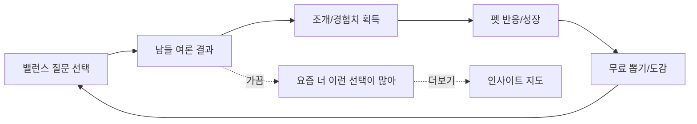

# Product Refocus Cold Audit Review

> 검토 대상: `AI-Sessions/wiki/decisions/product-refocus-cold-audit.md`  
> 작성일: 2026-06-05  
> 목적: Balance Island의 정체성을 너무 복잡하지 않게 유지하기 위해, cold audit의 판단을 검증하고 더 단순한 제품 방향을 제안한다.

---

## 1. 결론

`product-refocus-cold-audit.md`의 핵심 판단은 **대체로 타당하다.**

현재 앱은 원래의 강점인 **심심풀이 밸런스 게임 → 여론 확인 → 펫 반응/성장**보다, 최근 작업에서 **16섬 타입, 군도, 궁합, 친구 추측, 인사이트 그래프** 쪽으로 무게중심이 이동했다. 이 방향은 기획적으로 흥미롭지만, 초기 제품 정체성에는 과하다.

가장 좋은 방향은 다음 한 문장으로 정리된다.

> **“심심풀이 밸런스 질문을 고르면, 남들 여론을 보고, 내 선택을 먹고 자라는 펫을 모으고 돌보는 앱.”**

자기발견은 전면의 “성격검사 리포트”가 아니라, 펫의 말풍선과 짧은 기록 속에 은근히 묻어나야 한다.

---

## 2. Cold Audit에서 타당한 부분

### 2.1 “3개의 기둥” 재정의는 정확하다

audit이 잡은 3개 기둥은 현재 제품이 가장 단순하게 살아날 수 있는 축이다.

1. **가벼운 놀이**
   - 2지선다 밸런스 질문.
   - 한 손으로 빠르게 고르는 피드.
   - 무거운 검사/리포트 진입 금지.

2. **여론 + 은근한 자기발견**
   - “남들은 이렇게 골랐네?”가 즉시 재미다.
   - “나는 왜 이걸 골랐지?”가 사후 자기발견이다.
   - 사용자가 먼저 궁금해하지 않았는데 긴 분석을 던지면 앱이 무거워진다.

3. **펫 수집/돌봄**
   - 펫은 감정적 중심이다.
   - 밸런스 게임을 계속 하게 만드는 이유가 된다.
   - “내 선택이 펫을 키운다”는 인과가 가장 직관적이다.

이 3개는 서로 충돌하지 않는다. 반대로 16섬/궁합/친구추측은 각각 별도 앱처럼 확장될 가능성이 높다.

### 2.2 16섬/궁합/친구추측 PARK 판단은 맞다

코드 기준으로도 이미 다음 요소가 존재한다.

- `src/components/island/IslandTypeCard.tsx`
- `src/app/compat.tsx`
- `src/app/guess/[id].tsx`
- `src/services/islandTypeService.ts`
- `compute_user_island_type`
- `compute_island_compat`
- `submit_island_friend_guess`

이들은 기능 자체가 나쁜 것은 아니다. 다만 홈/섬 탭 전면에 올라오면 사용자가 받는 첫인상이 바뀐다.

현재 전면 인상:

> “나는 무슨 섬 타입이고, 누구와 궁합이 맞고, 친구는 나를 어떻게 볼까?”

원래 의도에 더 맞는 인상:

> “질문 하나 골랐더니 남들 결과가 보이고, 내 펫이 반응하네?”

초기 제품에서는 두 번째가 훨씬 강하다. 첫 번째는 바이럴 욕심은 있지만, 제품을 MBTI 아류처럼 보이게 만든다.

### 2.3 인사이트맵은 “보상 화면”이 아니라 “더보기”여야 한다

Obsidian/마인드맵 방향은 앱의 장기 차별점으로 가치가 있다. 하지만 첫 화면에서 복잡한 그래프가 보이면 “심심풀이” 감각을 깨뜨린다.

권장 위치:

- 기본 피드: 여론과 펫 반응 중심.
- 섬 탭: 펫 집, 오늘의 한 줄, 수집/돌봄 중심.
- 인사이트맵: 사용자가 궁금해서 눌렀을 때만 깊게 보는 “내 선택의 근거 지도”.

즉, 인사이트맵은 삭제가 아니라 **depth 2 기능**이다.

---

## 3. Cold Audit에서 보완해야 할 부분

### 3.1 “펫 자체 가챠”는 조심해야 한다

audit은 “펫 한정판 가챠·수집 도감”을 최우선 신규 투자로 제안한다. 방향은 좋지만, 펫 자체를 완전 랜덤 뽑기로 만들면 기존의 강점 하나가 약해진다.

기존 강점:

> “내 선택과 성향이 나의 대표 펫을 만든다.”

펫을 전부 랜덤 뽑기로 바꾸면:

> “그냥 운 좋게 나온 펫이다.”

이러면 자기발견과 펫의 연결이 끊긴다.

더 좋은 절충안:

| 층 | 역할 | 획득 방식 |
|---|---|---|
| 대표 펫 | 내 선택/성향을 대표하는 메인 동반자 | 성향 기반 배정 + 사용자가 후보 중 선택 |
| 펫 변종/스킨 | 한정판 욕망, 수집, 시즌성 | 무료재화 뽑기 |
| 동료 펫 | 도감 수집, 꾸미기, 방문자 | 이벤트/뽑기/출석 |
| 섬 테마 | 펫이 사는 공간의 분위기 | 기존 theme draw 재사용 |

이렇게 하면 “내 펫”의 정체성은 유지하면서도, 한정판 수집 욕망을 살릴 수 있다.

### 3.2 “질문 뱅크 453, 13카테고리”는 현재 상태와 불일치 가능성이 있다

최근 계획/커밋 기준으로 확인된 질문 뱅크는 다음 흐름이다.

- base seed 30
- `data/question-bank/*.json` 178
- 총 208 기준으로 운영 계획이 정리됨

따라서 audit의 “453, 13카테고리” 표현은 실제 repo 상태와 다를 가능성이 있다. 리뷰 문서나 다음 계획에는 **현재 라이브/JSON 기준 숫자**를 다시 확인해서 반영해야 한다.

권장:

- 제품 방향 판단에는 “질문 수”보다 “질문 성격”을 우선한다.
- 숫자는 `scripts/admin/question-bank-report.sql`과 `scripts/seed-question-bank.mjs --check` 결과로만 기록한다.

### 3.3 “trait 균형 강박 ↓”는 맞지만, trait 품질 관리는 버리면 안 된다

audit은 실생활 고민형 질문을 늘리자고 한다. 맞다. 다만 trait 균형을 너무 내려놓으면 자기발견/펫 매칭이 흐려진다.

정리하면:

- 질문 소재는 **공감 고민** 중심.
- 내부 태깅은 **canonical 10 trait 품질 유지**.
- 사용자에게는 trait 축 이름을 과하게 노출하지 않는다.

즉, trait은 운영자가 보는 엔진이지, 사용자가 보는 제품 언어가 아니다.

---

## 4. 추천 제품 방향

### 4.1 앱 정체성

최종 추천 문장:

> **“밸런스 질문으로 남들 생각을 보고, 내 선택을 먹고 자라는 펫을 모으는 가벼운 자기발견 앱.”**

더 짧은 앱 소개:

> **“고르고, 여론 보고, 펫 키우기.”**

제품 화면별 역할:

| 화면 | 해야 할 일 | 하지 말아야 할 일 |
|---|---|---|
| 피드 | 질문 선택, 여론 결과, 조개/펫 반응 | 긴 성향 리포트 |
| 섬 | 펫 집, 오늘의 한 줄, 돌봄, 수집 | 16타입/궁합/친구추측 전면 노출 |
| 작성 | 사용자의 고민 질문 제출 | 즉시 AI 자동 생성/복잡한 분석 |
| 인사이트 | 근거 지도 더보기 | 첫 화면 핵심 루프 대체 |
| 프로필 | 내 펫/도감/기록 요약 | 채용/진단처럼 보이는 성향 고정 라벨 |

### 4.2 핵심 루프

핵심은 “자기발견”이 루프를 방해하지 않고, 보상처럼 가끔 떠야 한다는 점이다.

### 4.3 전면 카피 톤

좋은 톤:

- “남들은 B를 더 많이 골랐어요.”
- “너는 요즘 익숙한 선택에 마음이 가는 편이에요.”
- “펫이 방금 선택을 기억했어요.”
- “오늘의 조개를 모았어요.”
- “새 펫 스킨을 만날 수 있어요.”

피해야 할 톤:

- “당신은 OO형입니다.”
- “당신의 궁합 점수는 87점입니다.”
- “이 섬 타입은 이런 사람입니다.”
- “친구들이 보는 당신의 진짜 모습.”
- “성격 분석 리포트.”

---

## 5. 구체적 조정 제안

### P0. 섬 탭 다이어트

현재 `src/app/(tabs)/island.tsx`는 `IslandTypeCard`를 렌더링한다.

권장:

- `IslandTypeCard`를 섬 탭 기본 노출에서 제거.
- `/compat`, `/guess/[id]`는 route는 남기되 진입 링크 숨김.
- `IslandTypeCard`는 삭제하지 않고 `PARK` 상태로 보관.

대체 카드:

> **오늘 펫의 한마디**  
> “오늘은 새로운 쪽을 고르는 선택이 조금 더 많았어요. 펫이 바깥 냄새를 맡고 싶어 해요.”

카드 구성:

- 펫 이미지
- 기분/에너지
- 오늘의 조개
- 무료 뽑기 가능 여부
- “최근 선택 한 줄”

### P1. 여론 결과를 더 강하게

이미 `ChoiceEchoSheet`에는 `rarityPercent`, `rarityHeadline`, `rarityFlavor`, `petLine`이 있다. 이 방향이 제품의 심장에 가깝다.

강화 제안:

- 투표 직후 결과바를 더 크게.
- “다수파/소수파/반반” 뱃지.
- “내가 고른 쪽을 고른 사람 N%”를 첫 줄에.
- “펫 반응”을 바로 아래에.

중요:

- “희귀도”는 성격 희귀도가 아니라 **선택 여론 희귀도**로 제한한다.
- 이러면 가볍고 안전하다.

### P2. 펫 중심 수집으로 재배열

현재 DB에는 `pet_species`, `pet_species_traits`, `user_pet_state`, `theme_draw_*`, `ThemeProbabilitySheet` 등이 있다. 즉 완전 새로 만들 필요는 없다.

추천 MVP:

1. 대표 펫은 `assign_personality_pet`로 유지.
2. 뽑기는 우선 `theme_draw`를 활용하되 UI 언어를 “펫이 사는 공간/펫 선물”로 바꾼다.
3. 도감은 “펫 스킨/섬 테마/동료”를 한 화면에 아주 단순하게 보여준다.
4. 한정판은 무료재화/출석권으로만 운영한다.

유료는 아직 금지:

- 확률형 아이템 신뢰 문제.
- 1인 개발자의 운영/CS 부담.
- 제품 정체성 검증 전 수익화 리스크.

### P3. 질문 콘텐츠 방향 전환

앞으로 늘릴 질문은 “trait 균형”만 보고 쓰지 말고, 사용자가 진짜 물어보고 싶은 고민을 우선한다.

좋은 질문:

- “안 친한 친구 결혼식, 안 가고 5만 원 vs 참석하고 10만 원”
- “퇴근 후 바로 쉬기 vs 새 취미 배우기”
- “연락 바로 답장하기 vs 여유 있을 때 몰아서 답하기”
- “모임에서 계산 정확히 나누기 vs 분위기상 내가 더 내기”

나쁜 질문:

- “성공하기 vs 실패하기”
- “건강하게 살기 vs 매일 아프기”
- “천재지만 외롭기 vs 평범하지만 인기 많기”
- 너무 철학적이거나 밈만 있고 실제 선택 맥락이 없는 질문.

운영 원칙:

- 실생활 딜레마 70%
- 취향/음식/가벼운 질문 20%
- 자기발견용 축 보강 질문 10%

### P4. 인사이트맵은 “궁금할 때 보는 지도”

단일 마음 지도 방향은 유지하되, 앱 정체성의 중심으로 과하게 밀지 않는다.

권장:

- 피드 투표 후 CTA는 기본 “다음 질문”.
- “내 지도 보기”는 보조 CTA.
- 섬 탭에서는 작은 preview만.
- 상세 지도는 7~10개 이상 답한 사용자에게 의미 있게 노출.

---

## 6. 무엇을 삭제하지 말고 PARK할까

다음은 당장 삭제하지 않는다. 이미 만든 자산이고, 나중에 실험할 수 있다.

- `IslandTypeCard`
- `/compat`
- `/guess/[id]`
- `compute_user_island_type`
- `compute_island_compat`
- `submit_island_friend_guess`
- `island-type-identity-plan.md`

다만 제품 기본 루프에서는 숨긴다.

PARK 기준:

- 내비게이션에 노출하지 않음.
- 섬 첫 화면에 노출하지 않음.
- 신규 사용자의 첫 3분 안에 등장하지 않음.
- 공유/궁합 실험을 할 때만 feature flag로 다시 켬.

---

## 7. 제안하는 새 북극성 지표

복잡한 자기분석 앱이면 “리포트 완독률”을 볼 수 있지만, 이 앱은 그렇게 가면 안 된다.

추천 북극성:

> **하루에 사용자가 완료한 밸런스 선택 수와 그 뒤 이어진 펫 행동 수**

실무 지표:

- 질문 1개 이상 투표율
- 투표 후 결과 확인율
- Choice Echo 닫기 전 체류 시간
- 투표 후 다음 질문 진행률
- 펫 케어/무료 뽑기 실행률
- D1/D7 재방문
- 사용자 제출 질문 수

후순위 지표:

- 궁합 공유율
- 친구 추측 초대율
- 16섬 결과 공유율

이 후순위 지표가 먼저 올라오면 제품이 다시 무거워질 가능성이 있다.

---

## 8. 실행 순서 제안

### Step 1. 노출 다이어트

- `IslandTypeCard` 기본 노출 제거.
- `/compat`, `/guess` 진입 링크 숨김.
- 섬 탭 첫 화면을 펫/조개/오늘의 한 줄 중심으로 정리.

### Step 2. Choice Echo 강화

- 여론 퍼센트 시각 강조.
- 다수/소수/반반 뱃지.
- 펫 반응을 더 짧고 귀엽게.
- “내 지도 보기”는 보조 CTA로 낮춤.

### Step 3. 펫 수집 MVP

- 대표 펫은 성향 기반 유지.
- 수집 대상은 펫 스킨/동료/테마로 시작.
- 도감은 1화면 단순 카드 그리드.
- 무료 뽑기/출석권만 사용.

### Step 4. 질문 콘텐츠 재정렬

- 실생활 고민형 질문 배치 추가.
- 사용자 제출 큐에서 좋은 고민을 선별.
- 관리자 분류는 계속 trait을 붙이되, 사용자에게 축 이름은 덜 노출.

### Step 5. 인사이트맵 톤 다운

- 섬 탭에서는 preview.
- 상세 지도는 더보기.
- 긴 리포트 금지, 한 줄 발견 중심.

---

## 9. 최종 제안

현재 가장 좋은 제품 방향은 **“섬 타입 정체성 앱”이 아니라 “여론이 붙은 밸런스 게임 + 펫 수집 자기발견 앱”**이다.

섬은 버리지 않는다. 다만 섬의 역할을 바꾼다.

- 기존 과한 방향: “나는 16섬 중 어떤 섬인가?”
- 추천 방향: “내 펫이 사는 공간이고, 내 선택 흔적이 가볍게 쌓이는 곳.”

펫은 더 전면으로 온다.

- 기존: 성향 분석 결과의 장식.
- 추천: 매일 돌아오게 만드는 감정적 중심.

자기발견은 더 조용해진다.

- 기존: 지도, 타입, 궁합, 리포트.
- 추천: “요즘 너 이런 선택 많더라” 정도의 짧은 발견.

이렇게 가면 앱은 심플해진다.

> **질문을 고른다. 남들 생각을 본다. 펫이 반응한다. 펫과 섬이 조금 자란다.**

이 4단계만 첫 출시의 영혼으로 잡는 것이 가장 낫다.

---

## 10. References

- `AI-Sessions/wiki/decisions/product-refocus-cold-audit.md`
- `AI-Sessions/wiki/projects/island-type-identity-plan.md`
- `AI-Sessions/wiki/design/visual-ui-guidelines.md`
- `docs/2026-06-04-trendy-self-discovery-upgrade-plan.md`
- `docs/2026-06-05-critical-remaining-work.md`
- `src/components/island/IslandTypeCard.tsx`
- `src/app/compat.tsx`
- `src/app/guess/[id].tsx`
- `src/components/feed/ChoiceEchoSheet.tsx`
- `src/app/(tabs)/island.tsx`
- `supabase/migrations/202606020200_personality_pet_theme_economy.sql`
