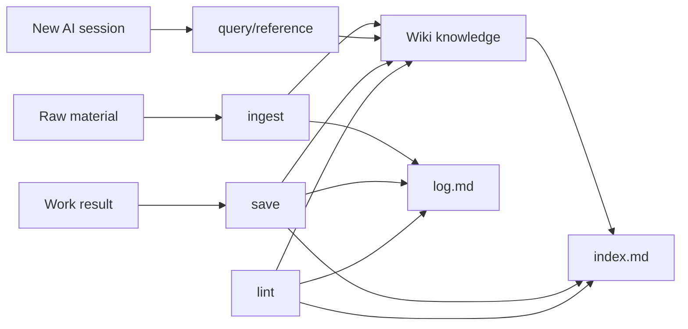

# 01. System Concept

Obsidian AI Wiki는 "AI가 매번 처음부터 다시 읽고 추측하는 문제"를 줄이기 위한 업무 기억 장치입니다.

일반 문서 저장소와 다른 점은 세 가지입니다.

1. 원본과 정리본을 분리한다.
2. 에이전트가 따라야 할 명령어와 저장 규칙을 명확히 둔다.
3. 저장할 가치가 있는 정보만 남겨 장기적으로 wiki가 오염되지 않게 한다.

## 이 시스템이 해결하는 문제

AI 에이전트와 오래 일하면 다음 문제가 반복됩니다.

- 이전 세션의 결정 근거를 찾기 어렵다.
- 같은 내용을 `docs`, chat, issue, local note에 중복 저장한다.
- 새 에이전트가 오래된 문서를 최신 상태로 착각한다.
- 일회성 추측이나 중간 생각이 wiki에 남아 검색 품질을 떨어뜨린다.
- 민감한 토큰, API key, OAuth secret이 문서에 섞일 위험이 있다.

Obsidian AI Wiki는 이 문제를 `raw`, `wiki`, `conversations`, `index`, `log`, `prompts`, `validator`로 나누어 해결합니다.

## 운영 모델

## 좋은 wiki의 기준

좋은 wiki는 많이 저장된 wiki가 아닙니다. 다음 조건을 만족하는 wiki입니다.

- 새 에이전트가 5분 안에 프로젝트 맥락을 복원할 수 있다.
- 결정사항에는 날짜, 근거, 현재 상태가 있다.
- raw 원본은 변하지 않고, wiki는 요약과 판단만 가진다.
- 중요한 문서는 `index.md`에서 찾을 수 있다.
- 최근 작업 흐름은 `log.md`에서 볼 수 있다.
- 검증 명령이 구조 문제를 자동으로 발견한다.

## 저장 5가지 필터

`save` 전에 아래 중 하나 이상을 만족해야 합니다.

1. 이 정보가 향후 실무에 반복해서 재사용될 데이터인가?
2. 다른 에이전트나 동료가 프로젝트를 이어받기 위해 반드시 읽어야 하는가?
3. 의사결정의 근거와 결정권자를 나중에 추적할 필요가 있는가?
4. 실패한 방식이라 다시 시도하면 안 되는 리스크 정보인가?
5. 팀 전체가 맞춰야 하는 공통 규칙이나 디자인 가이드인가?

하나도 만족하지 않으면 wiki에 저장하지 않습니다. 필요하면 `AI-Sessions/conversations/`나 raw 로그에만 남깁니다.
