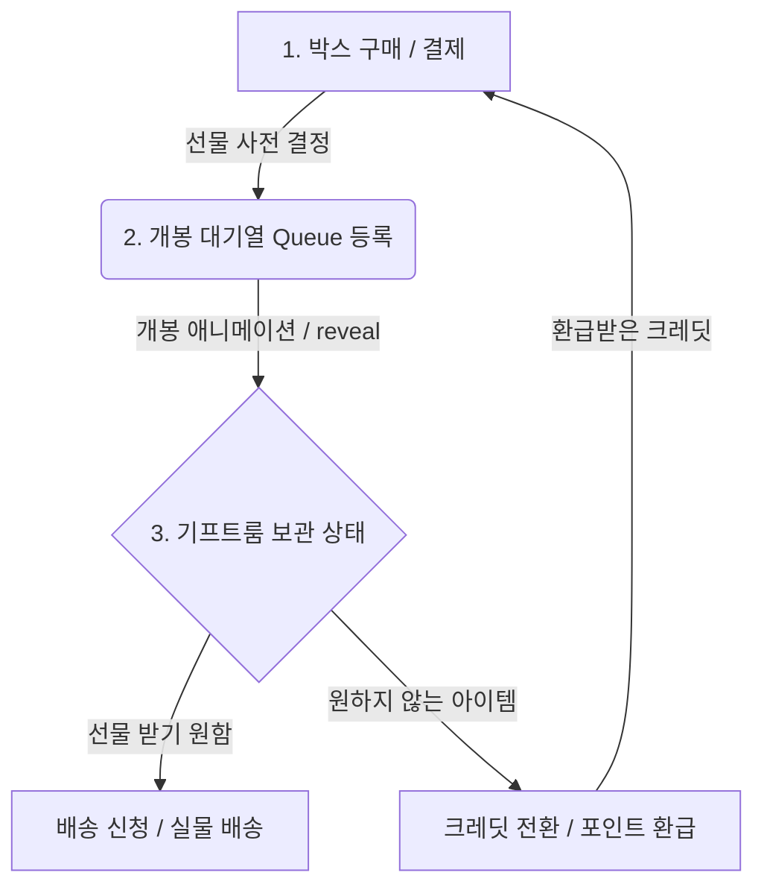

# 🎁 Ribbon Room 뽑기(가챠) 시스템 아키텍처 및 구현 가이드

이 문서는 **리본룸(Ribbon Room)** 프로젝트의 핵심 기능인 **랜덤 선물 박스(가챠) 시스템**의 설계 및 구현 방식을 상세히 분석하고, 이를 다른 프로덕션 서비스에 바로 적용할 수 있도록 일반화하여 정리한 가이드라인입니다.

---

## 1. 비즈니스 모델 및 사용자 경험 흐름 (UX Flow)

리본룸의 뽑기 시스템은 일반적인 가챠 게임과 달리 **실물 커머스**와 **가상 포인트(크레딧) 순환 체계**가 결합된 형태를 띱니다.



1. **박스 둘러보기 및 선택**: 사용자는 각기 다른 테마(예: 차분한 리빙, 정돈된 작업 공간 등)와 상품 라인업을 가진 선물 박스를 선택합니다.
2. **테스트 구매 (Purchase)**: 결제가 완료되는 즉시, 어떤 선물이 나올지 **서버(혹은 백엔드 엔진)에서 즉시 결정**되어 대기열(Queue)에 적재됩니다.
3. **박스 열어보기 (Open)**: 사용자는 개봉 대기열에 있는 박스를 열어 선물을 확인합니다. (이 단계에서 연출/애니메이션이 제공됩니다.)
4. **기프트룸 확인 및 결정 (Asset Management)**:
   - **배송 신청**: 해당 선물이 마음에 들면 실물 배송을 신청합니다.
   - **크레딧 전환 (Recycle)**: 선물이 마음에 들지 않으면, 상품 고유의 크레딧 가치만큼 **가상 크레딧으로 즉시 환전**합니다. 이 크레딧으로 새로운 박스를 다시 구매할 수 있어 지속적인 순환이 발생합니다.

---

## 2. 도메인 엔티티 설계 (Data Models)

이 시스템을 다른 프로젝트에 이식할 때 핵심이 되는 데이터 모델 스키마 정의(TypeScript 기반)입니다.

### 2.1 기초 마스터 데이터 (Static Configuration)

#### 선물 아이템 (`Gift`)
각 상품의 기본 정보를 가지고 있으며, 환급 시 제공될 크레딧 가치(`creditValue`)를 포함합니다.
```typescript
export type Gift = {
  slug: string;        // 고유 식별자 (예: "rose-mug")
  name: string;        // 상품명 (예: "로즈 머그")
  category: string;    // 카테고리 (예: "리빙")
  note: string;        // 한 줄 설명 (예: "부드러운 로즈 톤이 감도는 데일리 머그")
  creditValue: number; // 크레딧 환산 가치 (예: 4800)
};
```

#### 선물 박스 (`GiftBox`)
뽑기 상자로, 해당 상자에서 나올 수 있는 선물 아이템 목록(`gifts`)을 참조합니다.
```typescript
export type GiftBox = {
  slug: string;             // 박스 식별자 (예: "morning-selection")
  name: string;             // 박스 이름 (예: "모닝 셀렉션 박스")
  priceLabel: string;       // 가격 표시 (예: "5,000원")
  gifts: string[];          // 획득 가능한 Gift slug 목록 (예: ["rose-mug", "paper-incense"])
  accent: "rose" | "sage" | "gold"; // UI 테마 컬러
};
```

### 2.2 사용자 상태 데이터 (Dynamic User State)

#### 구매 내역 / 개봉 대기열 (`Purchase`)
사용자가 결제했으나 아직 개봉하지 않은 상태입니다. **보안을 위해 획득할 아이템(`giftSlug`)이 구매 시점에 결정되어 암호화되어 저장됩니다.**
```typescript
export type Purchase = {
  id: string;          // 구매 건 고유 ID (예: "morning-selection-1718000000")
  boxSlug: string;     // 구매한 박스 ID
  giftSlug: string;    // [★중요] 구매 시점에 미리 할당된 획득 예정 선물 ID
  purchasedAt: string; // 구매 일시 (ISO String)
};
```

#### 획득 자산 / 기프트룸 보관함 (`Asset`)
상자를 열어 획득한 실물 자산의 목록입니다. 사용자의 선택에 따라 배송 대기 상태(`stored`)이거나 크레딧으로 전환된 상태(`converted`)를 가집니다.
```typescript
export type Asset = {
  id: string;          // 자산 고유 ID (예: "asset-morning-selection-1718000000")
  purchaseId: string;  // 연관된 구매 ID
  boxSlug: string;     // 출처 박스 ID
  giftSlug: string;    // 획득한 선물 ID
  openedAt: string;    // 개봉 일시
  status: "stored" | "converted"; // 상태: 보관 중(배송 가능) | 크레딧 전환 완료
};
```

---

## 3. 핵심 비즈니스 로직 및 상태 관리 (React Context & State)

리본룸 MVP의 프론트엔드 상태 관리 코드를 기반으로 일반화한 핵심 액션 함수들입니다.

### 3.1 상자 구매 및 상품 결정 (`purchaseBox`)
구매 액션 발생 시, 새로운 `Purchase` 인스턴스를 대기열 처음에 추가합니다. 상품 결정 알고리즘(`nextGiftSlug`)이 호출됩니다.
```typescript
purchaseBox: (boxSlug) => {
  setState((current) => ({
    ...current,
    purchases: [
      {
        id: `${boxSlug}-${Date.now()}`,
        boxSlug,
        giftSlug: nextGiftSlug(boxSlug, current), // 상품 사전 결정
        purchasedAt: new Date().toISOString(),
      },
      ...current.purchases,
    ],
  }));
}
```

### 3.2 상자 개봉 (`openPurchase`)
대기열에서 아이템을 제거하고 `Asset` 목록으로 이동시킵니다. 기본 상태는 `"stored"`로 들어갑니다.
```typescript
openPurchase: (purchaseId) => {
  setState((current) => {
    const purchase = current.purchases.find((item) => item.id === purchaseId);
    if (!purchase) return current;
    
    return {
      ...current,
      // 대기열에서 제거
      purchases: current.purchases.filter((item) => item.id !== purchaseId),
      // 기프트룸(자산)에 추가
      assets: [
        {
          id: `asset-${purchase.id}`,
          purchaseId: purchase.id,
          boxSlug: purchase.boxSlug,
          giftSlug: purchase.giftSlug,
          openedAt: new Date().toISOString(),
          status: "stored",
        },
        ...current.assets,
      ],
    };
  });
}
```

### 3.3 자산의 크레딧 전환 (`convertAsset`)
보관 중인 아이템을 재활용하여 가상 크레딧을 회수하는 기능입니다.
```typescript
convertAsset: (assetId) => {
  setState((current) => {
    const asset = current.assets.find((item) => item.id === assetId);
    if (!asset || asset.status === "converted") return current;
    
    const gift = getGiftBySlug(asset.giftSlug);
    
    return {
      ...current,
      credits: current.credits + (gift?.creditValue ?? 0), // 크레딧 추가
      assets: current.assets.map((item) =>
        item.id === assetId ? { ...item, status: "converted" } : item // 전환 완료 표시
      ),
    };
  });
}
```

---

## 4. 뽑기 결정 알고리즘 (Selection Algorithms)

### 4.1 MVP 방식: 결정론적 순환 방식 (Deterministic Round-Robin)
리본룸 MVP 데모 앱에서는 **유저의 총 뽑기 이력을 조회하여 상자에 든 상품 목록을 순서대로 순환 반환**하는 방식을 사용했습니다.

```typescript
function nextGiftSlug(boxSlug: string, currentState: MvpState) {
  const box = getBoxBySlug(boxSlug);
  if (!box) throw new Error(`Unknown box slug: ${boxSlug}`);
  
  // 사용자가 이 박스를 구매했거나 개봉하여 보유한 총 개수를 구함
  const historyCount =
    currentState.purchases.filter((p) => p.boxSlug === boxSlug).length +
    currentState.assets.filter((a) => a.boxSlug === boxSlug).length;
    
  // 순환 방식으로 결정 (Modulo 연산)
  return box.gifts[historyCount % box.gifts.length];
}
```
* **장점**: 데모/테스트 시 중복이 최소화되며 사용자가 여러 번 클릭할 때 상자에 포함된 모든 기프트를 중복 없이 경험해 볼 수 있습니다. (테스트에 용이)
* **단점**: 사용자가 다음 선물이 무엇인지 완벽하게 예측 가능하므로 실제 서비스용 가챠로는 부적합합니다.

### 4.2 프로덕션 방식: 가중치 확률 랜덤 (Weighted Random Selection)
실제 상용 서비스 개발 시에는 각 선물 아이템에 **확률 가중치**를 부여하여 무작위로 추출하는 알고리즘을 사용해야 합니다.

#### 가중치 데이터 구조 확장
```typescript
// 확률 아이템 정의
export type WeightedGift = {
  giftSlug: string;
  weight: number; // 예: 1000분율 가중치 (100 -> 10%, 5 -> 0.5%)
};

// 박스 정의에 확률 테이블 포함
export type ProductionGiftBox = GiftBox & {
  probabilities: WeightedGift[];
};
```

#### 가중치 랜덤 선택 알고리즘
```typescript
export function drawWeightedGift(box: ProductionGiftBox): string {
  const probabilities = box.probabilities;
  if (!probabilities || probabilities.length === 0) {
    throw new Error("확률 정보가 존재하지 않습니다.");
  }
  
  // 1. 전체 가중치의 합을 계산
  const totalWeight = probabilities.reduce((sum, item) => sum + item.weight, 0);
  
  // 2. 0 ~ 전체 가중치 합 사이의 난수 생성
  const randomValue = Math.random() * totalWeight;
  
  // 3. 난수가 가중치 구간에 걸치는지 확인하여 해당 아이템 반환
  let cumulativeWeight = 0;
  for (const item of probabilities) {
    cumulativeWeight += item.weight;
    if (randomValue <= cumulativeWeight) {
      return item.giftSlug;
    }
  }
  
  // 에러 대비 예외 처리 (마지막 요소 반환)
  return probabilities[probabilities.length - 1].giftSlug;
}
```

---

## 5. 프로덕션 상용화 시 데이터베이스 설계 가이드 (RDBMS)

실제 백엔드를 구축할 때 사용자의 데이터 무결성을 지키고 트랜잭션 충돌을 방지하기 위한 DB 설계안입니다.

### 5.1 데이터베이스 스키마 (PostgreSQL DDL 예시)

```sql
-- 1. 선물 박스 테이블
CREATE TABLE gift_boxes (
    slug VARCHAR(50) PRIMARY KEY,
    name VARCHAR(100) NOT NULL,
    price INT NOT NULL,
    accent VARCHAR(20) DEFAULT 'rose',
    created_at TIMESTAMP WITH TIME ZONE DEFAULT CURRENT_TIMESTAMP
);

-- 2. 개별 선물 아이템 테이블
CREATE TABLE gifts (
    slug VARCHAR(50) PRIMARY KEY,
    name VARCHAR(100) NOT NULL,
    category VARCHAR(50) NOT NULL,
    note TEXT,
    credit_value INT NOT NULL
);

-- 3. 박스별 확률 테이블 (1:N)
CREATE TABLE box_gift_probabilities (
    id SERIAL PRIMARY KEY,
    box_slug VARCHAR(50) REFERENCES gift_boxes(slug) ON DELETE CASCADE,
    gift_slug VARCHAR(50) REFERENCES gifts(slug),
    weight INT NOT NULL DEFAULT 100, -- 가중치
    UNIQUE(box_slug, gift_slug)
);

-- 4. 구매 내역 및 개봉 대기열 테이블
CREATE TABLE user_purchases (
    id VARCHAR(100) PRIMARY KEY,
    user_id VARCHAR(50) NOT NULL,
    box_slug VARCHAR(50) REFERENCES gift_boxes(slug),
    gift_slug VARCHAR(50) REFERENCES gifts(slug), -- 결정된 아이템 미리 저장 (선결정 방식)
    purchased_at TIMESTAMP WITH TIME ZONE DEFAULT CURRENT_TIMESTAMP,
    status VARCHAR(20) DEFAULT 'queued' -- 'queued' (미개봉), 'opened' (개봉 완료)
);

-- 5. 획득 자산 테이블
CREATE TABLE user_assets (
    id VARCHAR(100) PRIMARY KEY,
    user_id VARCHAR(50) NOT NULL,
    purchase_id VARCHAR(100) REFERENCES user_purchases(id),
    gift_slug VARCHAR(50) REFERENCES gifts(slug),
    opened_at TIMESTAMP WITH TIME ZONE DEFAULT CURRENT_TIMESTAMP,
    status VARCHAR(20) NOT NULL DEFAULT 'stored' -- 'stored' (보관), 'converted' (크레딧 전환), 'shipped' (배송중/완료)
);

-- 6. 사용자 잔고 테이블
CREATE TABLE user_balances (
    user_id VARCHAR(50) PRIMARY KEY,
    credits INT NOT NULL DEFAULT 0,
    updated_at TIMESTAMP WITH TIME ZONE DEFAULT CURRENT_TIMESTAMP
);
```

### 5.2 동시성 및 트랜잭션 무결성 관리
가사가 일어나는 순간(결제 및 크레딧 전환)은 돈과 직결되므로 반드시 **트랜잭션(Transaction)**으로 묶어서 원자성(Atomicity)을 보장해야 합니다.

#### 예시: 크레딧 전환(환급) 시점의 트랜잭션 흐름 (Node.js/Prisma 예시)
```typescript
async function convertAssetToCredits(userId: string, assetId: string) {
  return await prisma.$transaction(async (tx) => {
    // 1. 자산 유효성 검사 및 락 획득 (비관적 락 또는 상태 검사)
    const asset = await tx.userAsset.findUnique({
      where: { id: assetId },
    });
    
    if (!asset || asset.userId !== userId) {
      throw new Error("해당 자산을 찾을 수 없거나 소유주가 아닙니다.");
    }
    
    if (asset.status !== "stored") {
      throw new Error("이미 전환되었거나 배송 처리 중인 자산입니다.");
    }
    
    // 2. 자산의 금액(Credit Value) 조회
    const gift = await tx.gift.findUnique({
      where: { slug: asset.giftSlug }
    });
    const creditValue = gift?.creditValue ?? 0;
    
    // 3. 자산의 상태 변경
    await tx.userAsset.update({
      where: { id: assetId },
      data: { status: "converted" }
    });
    
    // 4. 유저 잔고 테이블의 크레딧 가산
    const updatedBalance = await tx.userBalance.update({
      where: { userId },
      data: {
        credits: {
          increment: creditValue
        }
      }
    });
    
    return { success: true, newCredits: updatedBalance.credits };
  });
}
```

---

## 6. 보안 및 운영 설계 핵심 고려사항

다른 앱에서 가챠 메커니즘을 연동할 때 반드시 준수해야 하는 베스트 프랙티스입니다.

### 🛡️ 1. 선결제 선결정 (Pre-determination) 패턴 적용
사용자가 뽑기 버튼을 누르고 개봉 애니메이션이 돌아갈 때 백엔드에 결과를 요청하면 안 됩니다.
* **이유**: 클라이언트 네트워크 연결이 끊기거나 고의로 앱을 강제 종료(F5 연타, 강제 리부팅 등)하여 자신이 원하지 않는 아이템이 나왔을 때 무효화를 시도하려는 악의적 행위를 사전에 차단하기 위해서입니다.
* **해결책**: 결제가 완료되거나 뽑기 트리거가 일어나는 즉시 백엔드 트랜잭션 내부에서 결과를 뽑아서 `user_purchases`에 `gift_slug`를 박아둡니다. 그 후 클라이언트에서 개봉 요청을 보내면 저장되어 있던 결과를 보여주기만 하면 됩니다.

### 🔄 2. 크레딧 환급 비율 조율 (Retention vs Economy)
선물을 크레딧으로 변환해 주는 기능은 유저 이탈을 크게 줄여주는 훌륭한 장치입니다.
* **설계 팁**: 
  - 1회 뽑기 금액이 10,000원인 경우, 가장 가치가 낮은 꽝 상품의 환급 금액을 3,000 ~ 4,000원(30~40%) 선으로 책정하면 좋습니다.
  - 유저는 "꽝이 나와도 완전히 날아가는 것이 아니라 3판 더 모으면 한 번 더 뽑을 기회가 생긴다"고 인지하여 구매 허들이 낮아집니다.
  - 이를 위해 백엔드 스키마 설계 단계에서 각 `Gift` 엔티티 내에 독립된 `creditValue` 속성을 분리해 유동적으로 조율할 수 있어야 합니다.

### 📊 3. 난수 생성기(PRNG)의 무작위성 확보
백엔드 단에서 가중치 기반 랜덤을 돌릴 때 단순 프레임워크 기본 랜덤(예: JavaScript의 `Math.random()`)은 암호학적으로 강력하지 않아 패턴 예측 공격에 취약할 수 있습니다.
* **해결책**: 프로덕션 배포 시에는 운영체제의 보안 모듈을 이용하는 암호학적 난수 생성기를 도입해야 합니다.
  - Node.js: `crypto.randomBytes()` 또는 `crypto.getRandomValues()`
  - Python: `secrets` 모듈
